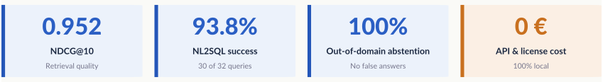
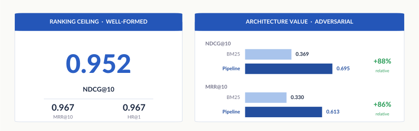
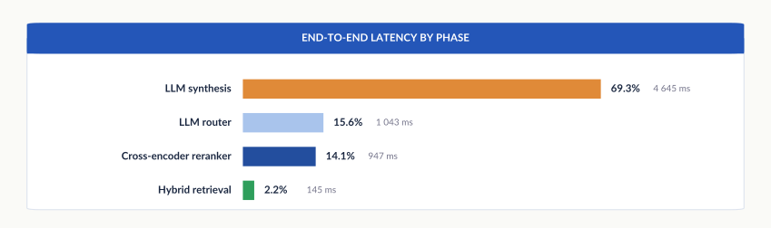
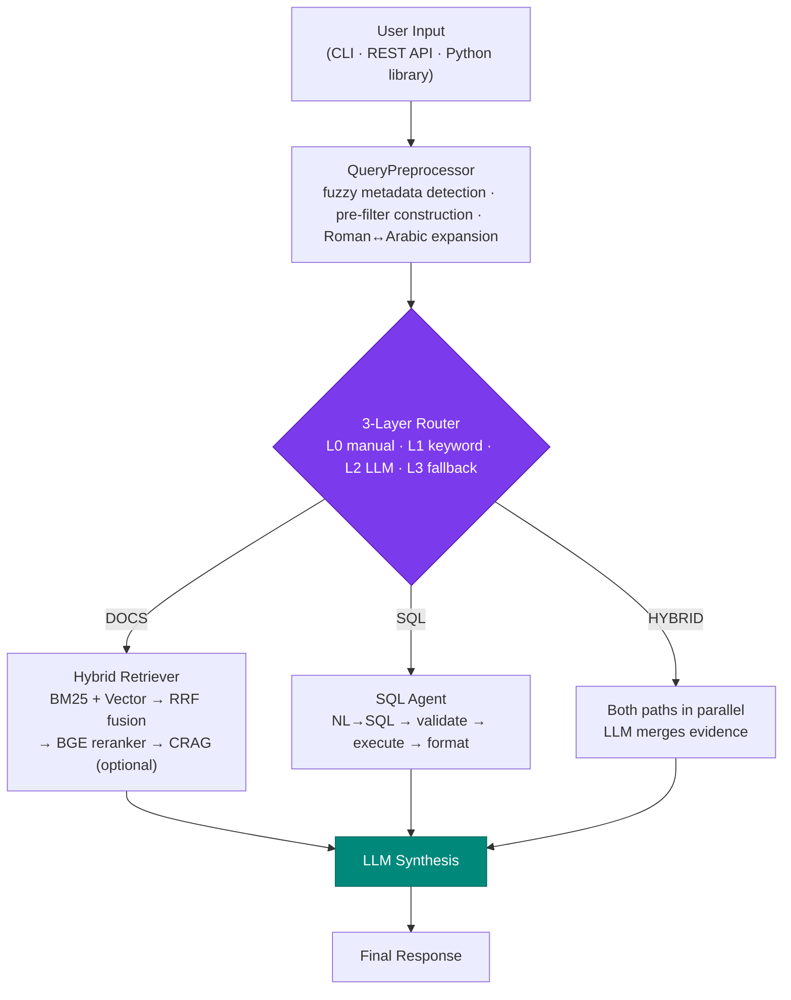
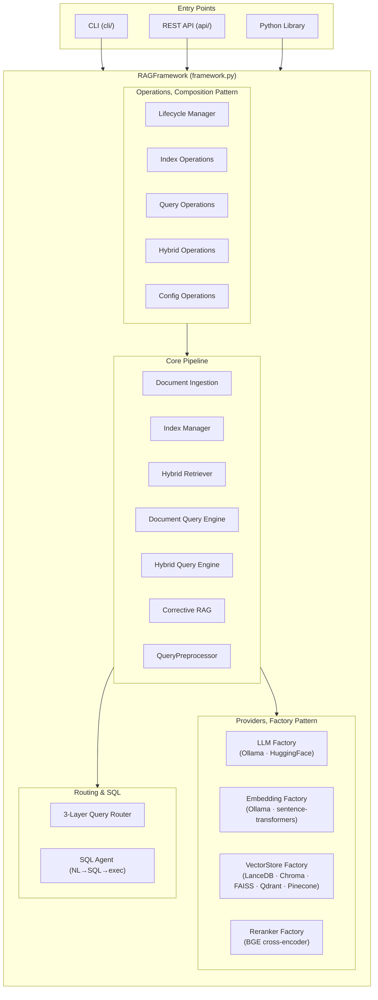
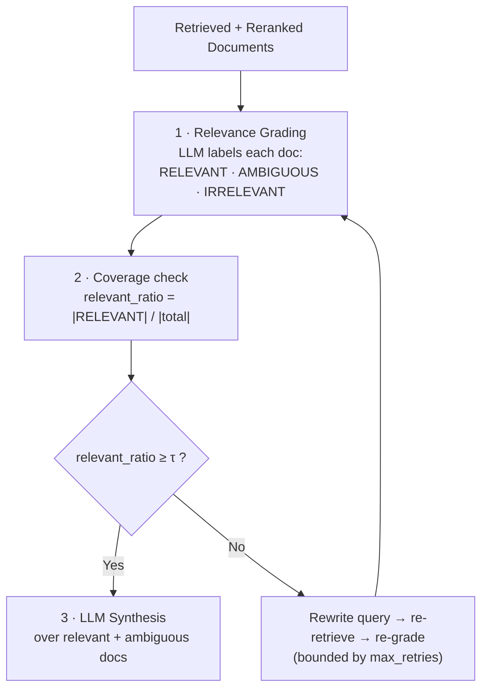
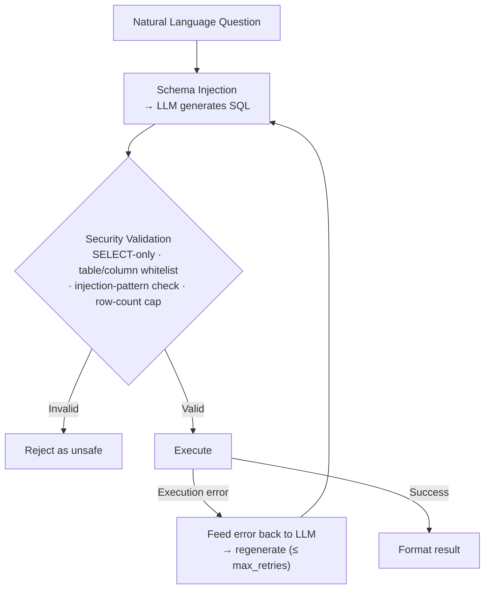
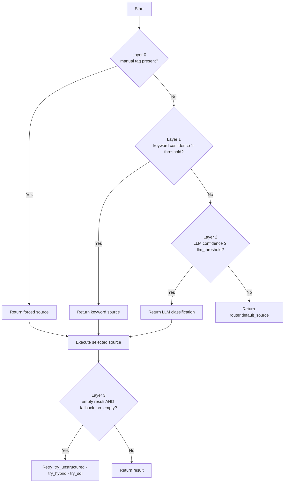
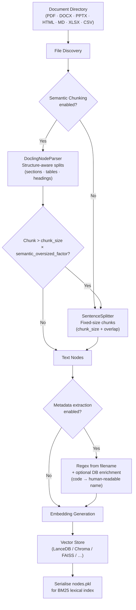

<div align="center">

# Local RAG Framework

**A fully local Retrieval-Augmented Generation system that answers questions from your documents, your SQL database, or both, through a single natural-language interface.**

*Ask one question. The system works out whether the answer lives in a PDF, in a database, or in both, and retrieves accordingly.*

<br/>

[](license)
[](https://python.org)
[]()

[](https://github.com/run-llama/llama_index)
[](https://lancedb.github.io/lancedb/)
[](https://ollama.com)
[](https://nextjs.org)
[](https://pytest.org)

<br/>

  <a href="https://www.youtube.com/watch?v=rBVghMyY3ao" target="_blank" rel="noopener noreferrer">
    
  </a>
  <br/>
  <sup>Click to watch a full walkthrough on YouTube</sup>

<br/>

*Bachelor's Thesis (Trabajo de Fin de Grado), Double Degree in Mathematics and Computer Engineering, University of Seville, 2025/26*

<br/>



</div>

---

## What this is

I built this as my final-year thesis, but I treated it like something I would have to maintain after the grade was in. It is a local RAG framework with one capability most systems skip over: it answers questions that span both unstructured documents and a relational database, and it decides where to look on its own.

You ask in plain language. The system classifies the question, retrieves from the right source (a PDF, a SQL table, or both at once), and writes an answer grounded in what it found. Every component runs locally on a consumer GPU. There are no API keys and no data leaves the machine.

The interesting engineering is not the happy path. It is everything around it: knowing when *not* to answer, recovering from a bad SQL query, measuring which part of the pipeline actually moves the numbers, and being willing to delete techniques that looked good on paper but did nothing here. That is what the rest of this README is about.

---

## The problem I wanted to solve

Most RAG systems assume all the knowledge lives in one place. In practice it never does. Organizations keep information in two shapes that need completely different retrieval strategies:

| Source type | Example question | What it actually needs |
|:---:|:---|:---|
| **Documents** | *"What is the evaluation methodology for the AI course?"* | Semantic search across PDFs, reports, policies |
| **Database** | *"How many elective courses are in the catalog?"* | A `SELECT COUNT(*)`, not vector similarity |
| **Both** | *"How many credits does AI have and what topics does it cover?"* | A SQL result and document context, merged sensibly |

A system that only handles one of these forces the user to know *where* to look before they can ask *what* they want. This framework removes that step. One question goes in, one answer comes out, and the routing happens underneath.

---

## What I'd point a reviewer to first

<table>
<tr>
<td width="50%" valign="top">

### The architecture holds up under change
- Composition over inheritance: `RAGFramework` delegates to five focused operation managers instead of one growing class.
- A factory layer makes providers hot-swappable. Switching LLM, embeddings, vector store, or reranker is a config change, not a code change.
- One YAML file drives the whole pipeline. Moving from Ollama to HuggingFace, or LanceDB to Pinecone, is a single line.

</td>
<td width="50%" valign="top">

### Every retrieval choice is grounded in a paper
The pipeline is not a pile of trendy parts. Each piece earns its place:
- Hybrid BM25 and dense retrieval with RRF fusion ([Cormack et al., 2009](#references))
- Cross-encoder reranking ([Nogueira & Cho, 2019](#references)) with BGE-M3 ([Chen et al., 2024](#references))
- Corrective RAG with LLM-graded relevance and query rewriting ([Yan et al., 2024](#references))
- Schema-conditioned NL-to-SQL with self-correction ([Pourreza & Rafiei, 2023](#references))

</td>
</tr>
<tr>
<td width="50%" valign="top">

### Nothing touches the cloud
Every component runs on consumer hardware:
- LLM inference through **Ollama**
- Embeddings from **BGE-M3** (multilingual)
- Reranking through a **FlagEmbedding** cross-encoder
- Vector storage in **LanceDB**

No API keys, no external calls, no data leaving the box.

</td>
<td width="50%" valign="top">

### I measured it honestly
- An 80-query supervised benchmark over a real corpus (154 PDFs, 39 SQL tables), split into well-formed and adversarial sets.
- A 7-configuration ablation that isolates what each retrieval component actually contributes.
- Per-phase latency telemetry from embedding all the way to synthesis.
- Metrics for routing accuracy, retrieval quality, SQL correctness, and behaviour under adversarial input.

</td>
</tr>
</table>

---

## Results

> Measured on a supervised 80-query benchmark over a **real corpus of 154 PDFs and 39 SQL tables** (the Computer Engineering degree at the University of Seville). The benchmark splits into a *well-formed* set (natural, in-vocabulary queries) and an *adversarial* set (colloquial paraphrase, typos, out-of-corpus questions). Full methodology lives in [Evaluation Framework](#evaluation-framework).

<div align="center">



<br/>



</div>

<br/>

Two numbers I care about most. First, **100% abstention on out-of-corpus queries**: when the answer is not in the corpus, the system declines instead of hallucinating. Second, the latency breakdown, because it told me exactly where to stop optimizing. Retrieval is 2% of the time budget. Tuning it would have been wasted effort. The generator is the bottleneck.

<details>
<summary><b>Full results table</b></summary>

| Dimension | Metric | Result |
|:---|:---|:---:|
| **Retrieval, full pipeline (C6)** | NDCG@10 (global) | **0.860** |
| | HR@10 / MRR@10 (global) | **0.933** / **0.838** |
| | NDCG@10 (well-formed ceiling) | **0.942** |
| | NDCG@10 (adversarial) | **0.695** |
| **NL-to-SQL agent** | Execution success rate | **93.8%** (30/32) |
| | Resolved on first attempt | **68.8%** |
| **Abstention** | Out-of-corpus queries refused | **100%** (12/12) |
| | Overall abstention accuracy | **84.6%** |
| **Latency** | End-to-end mean / P95 | **8.3 s** / **21.9 s** |

</details>

<details>
<summary><b>Component ablation: NDCG@10 by regime (the core experiment)</b></summary>

Seven configurations isolate each component's contribution over the 45 ground-truth retrieval queries (`wf` = well-formed, n=30; `adv` = adversarial, n=15):

| Config | Components | NDCG@10 (wf) | NDCG@10 (adv) | NDCG@10 (global) |
|:---|:---|:---:|:---:|:---:|
| C7 | naive RAG (uniform chunk + vector) | 0.863 | 0.614 | 0.780 |
| C1 | BM25 only | 0.880 | 0.369 | 0.710 |
| C2 | vector only | 0.863 | 0.614 | 0.780 |
| C3 | hybrid (BM25 + vector + RRF) | 0.923 | 0.583 | 0.810 |
| C5 | hybrid + reranker (no filter) | **0.952** | 0.571 | 0.825 |
| **C6** | **full pipeline (hybrid + filter + reranker)** | 0.942 | **0.695** | **0.860** |

The C5 well-formed peak of **0.952** is the system's ranking ceiling on in-vocabulary queries. The full pipeline (C6) gives up a sliver of that ceiling to gain **+0.124 NDCG@10 on adversarial queries**. That trade is the whole point of the architecture: I would rather lose a hair on easy questions than fall apart on messy ones.

</details>

<details>
<summary><b>Routing, SQL robustness, and latency breakdown</b></summary>

**Query router (80 queries):** the two well-defined classes route cleanly. `structured` recall is **1.000** (every SQL query correctly identified) and `unstructured` precision is **0.943**. Raw global accuracy lands at 65%, but that figure is dominated by the `hybrid` class, where the "failure" is diagnostic rather than fatal. The benchmark's hybrid queries turned out to be two single-source questions glued together (*"how many credits does X have **and** what topics does it cover?"*), and the classifier correctly decomposes them by routing each clause to its natural branch.

**NL-to-SQL agent (32 ground-truth SQL queries):** 93.8% execution success, 68.8% on the first attempt, 1.38 attempts on average. The *adversarial* split scores **higher** than the well-formed one (100% versus 88.9%), which surprised me until I looked closer: colloquial phrasing pushes the model into more schema exploration and more conservative SQL, which reduces column hallucination.

**Latency, synthesis is the bottleneck:** of the 8.3 s mean end-to-end, **LLM synthesis eats 69.3%** (around 4.6 s), the LLM router 15.6%, the reranker 14.1%, and the entire BM25 + vector + RRF retrieval stack just **2.1%**. The optimization target is not ambiguous: shorten the generator's context or swap the model. Touching retrieval would be noise.

</details>

<details>
<summary><b>Limitations and honest caveats</b></summary>

Stated plainly, because they bound what the numbers mean:
- **Benchmark scale.** 80 queries show stable trends and separate the configurations cleanly, but per-class confidence intervals (for example the hybrid router class, n=14) would be wide. I did not compute bootstrap CIs.
- **Single generator.** Every number uses `qwen3:8b`. Router behaviour, synthesis latency, and abstention all depend on it, and a larger model would likely cut failures. The retrieval ablation generalizes past the model, since BM25, vector, and reranker are generator-independent.
- **Closed domain.** The corpus is one degree's course catalog, and I wrote the queries with knowledge of that corpus. Evaluating on organic user queries is future work.
- **Abstention is a proxy.** I measure it by canonical-pattern detection against the prompt template, not by human semantic judgement.

</details>

---

## What I tried and threw away

The final architecture is what survived testing, not a checklist of popular components. Across eight sprints I implemented several widely-cited techniques and then removed them, because under local quantized models they did not earn their cost:

| Technique | Why I dropped it |
|:---|:---|
| **HyDE** (hypothetical-document embeddings) | No measurable retrieval gain on this corpus, and it added a full generation pass to every query. |
| **GraphRAG / LightRAG** (knowledge graphs) | Indexing cost and brittleness under a quantized local LLM outweighed the benefit at this corpus scale. |
| **Adaptive-RAG** (complexity-routed strategy) | The apparent gains did not hold up. The complexity classifier was unreliable under local models. |

What stayed is what measurably worked: hybrid retrieval with RRF and reranking, a depth-validated NL-to-SQL agent, a cascading router, and Corrective RAG. I think being able to say *why something is not in the system* matters as much as listing what is.

---

## Project scope

<div align="center">

| Capability | Coverage |
|:---|:---:|
| Pluggable vector stores | **5**: LanceDB, Chroma, FAISS, Qdrant, Pinecone |
| Document formats parsed | **8**: PDF, DOCX, PPTX, HTML, MD, TXT, XLSX, CSV |
| LLM and embedding back-ends | **Ollama** (local), **HuggingFace** |
| Prompt templates | **11**: Spanish, English, multilingual |
| Evaluation corpus | **154 PDFs, 39 SQL tables** (real university catalog) |
| Benchmark | **80 labelled queries**, 7-config retrieval ablation |
| Test suite | **23 test files**: unit, integration, evaluation |

</div>

---

## Table of Contents

- [Results](#results)
- [What I tried and threw away](#what-i-tried-and-threw-away)
- [System Architecture](#system-architecture)
- [Retrieval Pipeline, technical deep dive](#retrieval-pipeline-technical-deep-dive)
  - [Hybrid Retrieval with RRF Fusion](#hybrid-retrieval-with-rrf-fusion)
  - [Cross-Encoder Reranking](#cross-encoder-reranking)
  - [Corrective RAG](#corrective-rag)
  - [NL-to-SQL Agent](#nl-to-sql-agent)
- [3-Layer Query Router](#3-layer-query-router)
- [Document Ingestion Pipeline](#document-ingestion-pipeline)
- [Evaluation Framework](#evaluation-framework)
- [Features at a Glance](#features-at-a-glance)
- [Prerequisites & Installation](#prerequisites--installation)
- [Quick Start](#quick-start)
- [Configuration Reference](#configuration-reference)
- [Interfaces](#interfaces)
  - [CLI](#cli)
  - [REST API](#rest-api)
  - [Python Library](#python-library)
- [Demos](#demos)
- [Testing](#testing)
- [UI, Chat Interface](#ui-chat-interface)
- [Tech Stack](#tech-stack)
- [References](#references)

---

## System Architecture

The framework is built on composition over inheritance. `RAGFramework` delegates to five focused operation managers, each owning one responsibility boundary, and every provider is created through a factory so components stay interchangeable at configuration time without touching source code.

<div align="center">


<br/>

<sub>The end-to-end query pipeline, from preprocessing and routing through the documentary, SQL, and hybrid retrieval routes to final LLM synthesis.</sub>

</div>

<br/>

<details>
<summary><b>Simplified flow (Mermaid, renders natively on GitHub)</b></summary>



</details>

<details>
<summary><b>Expand: full component diagram (operations, core, providers)</b></summary>



</details>

---

## Retrieval Pipeline, technical deep dive

### Hybrid Retrieval with RRF Fusion

Dense vector retrieval captures meaning but stumbles on rare keywords, proper nouns, and exact-match needs. Sparse BM25 handles those cases but fails on paraphrase. So I run both in parallel and combine their rankings with **Reciprocal Rank Fusion** [Cormack et al., 2009].

For a document $d$ retrieved across ranking lists $R$ (one per retrieval modality):

$$\text{RRF}(d) = \sum_{r \in R} \frac{1}{k + \text{rank}_r(d)}$$

where $k = 60$ is a smoothing constant that softens the influence of top-rank outliers and $\text{rank}_r(d)$ is the 1-indexed position of document $d$ in ranking list $r$. A configurable $\alpha$ parameter blends the two streams before fusion:

$$\text{score}_{\text{hybrid}}(d) = \alpha \cdot \text{score}_{\text{vec}}(d) + (1 - \alpha) \cdot \text{score}_{\text{BM25}}(d)$$

where $\alpha \in [0, 1]$ (default 0.5). Setting $\alpha = 1$ degrades to pure vector retrieval and $\alpha = 0$ to pure lexical.

> **Reference:** Cormack, G. V., Clarke, C. L. A., & Büttcher, S. (2009). *Reciprocal rank fusion outperforms condorcet and individual rank learning methods*. SIGIR '09, pp. 758-759. [DOI: 10.1145/1571941.1572114](https://doi.org/10.1145/1571941.1572114)

---

### Cross-Encoder Reranking

The top-$K$ candidates from RRF fusion pass through a **BGE cross-encoder reranker** [Nogueira & Cho, 2019] before they reach the LLM context window. Cross-encoders run full self-attention over the concatenated query and document, which gives a relevance score strictly more accurate than the cosine similarity a bi-encoder uses [Reimers & Gurevych, 2019], at the cost of $O(K)$ inference passes.

Where a bi-encoder embeds query and document independently and compares with a dot product:

$$\text{sim}(q, d) = E_q(q) \cdot E_d(d)^\top$$

the cross-encoder processes them jointly:

$$\text{score}(q, d) = \text{CrossEncoder}([q; \texttt{[SEP]}; d])$$

which lets attention cross the query-document boundary at the token level. The top-$N$ documents ($N \ll K$) after reranking go to the LLM.

> **Reference:** Nogueira, R., & Cho, K. (2019). *Passage Re-ranking with BERT*. arXiv:1901.04085. The reranker model is BAAI/bge-reranker-v2-m3 [Chen et al., 2024].

---

### Corrective RAG

Standard RAG assumes the documents it retrieved are relevant. That assumption breaks when queries are ambiguous, the corpus is mixed, or the embedding model hits distribution shift. **Corrective RAG** [Yan et al., 2024] adds an LLM grading step that scores each retrieved chunk before synthesis.

**Pipeline:**



The `relevance_threshold` parameter ($\tau \in [0, 1]$, default 0.5) controls sensitivity. At $\tau = 0$, CRAG grades without ever triggering a rewrite. At $\tau = 1$, any irrelevant document forces one. `max_retries` caps the rewrite and re-retrieve loop.

> **Reference:** Yan, S., Gu, J., Zhu, Y., & Ling, Z. (2024). *Corrective Retrieval Augmented Generation*. arXiv:2401.15884.

---

### NL-to-SQL Agent

The SQL path is a schema-conditioned generation loop, modelled on DIN-SQL [Pourreza & Rafiei, 2023]. The agent gets a structured view of the schema (table descriptions, column types, foreign keys, and few-shot exemplars) and generates SQL that is validated before it ever runs.

**Self-correction loop** (up to `max_retries = 3`):



<details>
<summary><b>Defence-in-depth SQL security model</b></summary>

| Threat | Control |
|--------|---------|
| Destructive statements (`DROP`, `DELETE`, `UPDATE`) | Non-SELECT rejected before execution |
| Injection tautologies (`OR 1=1`) | Pattern validator plus LLM regeneration loop |
| Schema probing | Table and column whitelist |
| Data exfiltration | `max_rows` cap enforced at execution |
| Persistent malformed SQL | Bounded retries with an explicit failure signal |

</details>

> **Reference:** Pourreza, M., & Rafiei, D. (2023). *DIN-SQL: Decomposed In-Context Learning of Text-to-SQL with Self-Correction*. NeurIPS 2023.

---

## 3-Layer Query Router

The router decides whether a query is `UNSTRUCTURED` (documents), `STRUCTURED` (SQL), or `HYBRID`, without asking the user to tag anything. It works through three layers in strict priority order:

| Layer | Mechanism | Latency | When it fires |
|:---:|-----------|:---:|---------------|
| **0, Manual override** | Explicit tag in the query text | ~0 ms | Testing or forced routing |
| **1, Keyword rules** | Pattern matching over configurable vocabulary | ~1 ms | Confidence ≥ `keyword_confidence_threshold` |
| **2, LLM classifier** | LLM receives query plus schema summary, returns a class | ~200-800 ms | Layer 1 inconclusive |
| **3, Post-execution fallback** | If the primary source returns nothing, retry the alternative | Varies | Empty result set |

When Layer 1 resolves early it skips the LLM call entirely, which keeps latency low for common query patterns.

<details>
<summary><b>Decision tree</b></summary>



</details>

---

## Document Ingestion Pipeline



For parsing I use [Docling](https://github.com/DS4SD/docling) [Auer et al., 2024], an IBM Research toolkit that keeps document structure (section headings, table cells, reading order) intact during chunking. It noticeably beats naive character splitting on complex PDFs, which is most of what a real corpus contains.

Metadata extraction pulls fields from filenames with regex and can enrich them from SQLite (for example, resolving a subject code `2060001` into `"Fundamentos de Programación"`). That metadata then powers query-time pre-filtering: the `QueryPreprocessor` spots mentioned entities by fuzzy matching and builds vector store filters before retrieval runs, which cuts down false positives from documents that overlap semantically.

> **Reference:** Auer, C. et al. (2024). *Docling: An Efficient Open-Source Toolkit for AI-driven Document Conversion*. arXiv:2408.09869.

---

## Evaluation Framework

The repo includes a supervised evaluation pipeline (`rag/validation/`) with **80 labelled queries** I built from scratch over the real corpus (154 PDFs, 39 SQL tables). It is split into two sets, one to measure the ceiling and one to find the failure modes.

### Dataset Structure

The benchmark has a **well-formed** set (48 queries: clear, in-vocabulary, referring to real corpus entities) and an **adversarial** set (32 queries: semantic overlap, colloquial phrasing, deliberate typos, expected abstention, or out-of-domain):

| Family | Well-formed | Adversarial | Total | What it stresses |
|:---|:---:|:---:|:---:|:---|
| **RAG** (documents) | 25 | 10 | 35 | Unstructured retrieval quality |
| **SQL** (structured) | 10 | 8 | 18 | NL-to-SQL accuracy and self-correction |
| **Hybrid** | 8 | 6 | 14 | Multi-source routing and evidence merge |
| **Negative** | 5 | 4 | 9 | Abstention on absent-but-plausible facts |
| **Out-of-domain** | 0 | 4 | 4 | Abstention on unrelated queries |
| **Total** | **48** | **32** | **80** | |

Of these, **45 carry ground-truth retrieval labels** (the retrieval ablation set), **32 carry ground-truth SQL**, and **13 measure abstention** (negative plus out-of-domain). NDCG@*k* is the primary metric, because of the four canonical IR metrics (HR@*k*, MRR@*k*, P@*k*, NDCG@*k*) it is the one that explicitly rewards rank order [Järvelin & Kekäläinen, 2002].

Each query carries:
- `expected_source_pattern`: regex matching the expected source document(s)
- `expected_keywords`: minimum required terms in the answer
- `expected_abstention`: whether the system should decline to answer
- `expected_behaviors.routing`: expected router decision
- `expected_behaviors.crag_should_rewrite`: whether a CRAG rewrite should trigger
- `difficulty`: `easy`, `medium`, or `hard`

<details>
<summary><b>Per-query telemetry example</b></summary>

Every evaluation run logs `events.jsonl` with a per-query breakdown:

```json
{
  "query_id": "r24",
  "routing_decision": "unstructured",
  "routing_confidence": 0.91,
  "latency_ms": {
    "embedding": 42,
    "bm25": 8,
    "vector": 61,
    "rrf_fusion": 3,
    "reranker": 287,
    "crag_grading": 1240,
    "synthesis": 3810,
    "total": 5451
  },
  "crag_outcome": {
    "relevant": 4,
    "ambiguous": 1,
    "irrelevant": 2,
    "rewrite_triggered": true,
    "rewritten_query": "técnicas aprendizaje automático avanzado Ampliación IA evaluación práctica"
  }
}
```

</details>

```bash
# Run evaluation suite
cd rag
python validation/run_eval.py --run-id eval_v1

# Inspect results
python validation/inspect_run.py eval_v1
python validation/inspect_run.py eval_v1 --type sql
python validation/inspect_run.py eval_v1 --query-id r24
python validation/inspect_run.py eval_v1 --percentile 95   # latency P95
```

---

## Features at a Glance

| Category | What's implemented |
|----------|:-------------------|
| **LLM Providers** | Ollama (local), HuggingFace Transformers (local/remote) |
| **Embedding Providers** | Ollama, HuggingFace sentence-transformers (BGE, E5, MiniLM, and more) |
| **Vector Stores** | LanceDB (default), ChromaDB, FAISS, Qdrant, Pinecone |
| **Retrieval** | Dense vector, BM25, hybrid BM25+vector with RRF fusion |
| **Reranking** | BGE cross-encoder (bge-reranker-base / large / v2-m3), Ollama reranker |
| **SQL Databases** | SQLite, PostgreSQL, MySQL, with NL-to-SQL and self-correction |
| **Query Router** | 3-layer: keyword rules, LLM classifier, post-exec fallback |
| **Corrective RAG** | LLM-graded relevance plus configurable query rewriting |
| **Document Formats** | PDF, DOCX, PPTX, HTML, Markdown, TXT, XLSX, CSV |
| **Chunking** | Semantic (Docling-aware, structure-preserving), fixed-size |
| **Metadata** | Regex extraction from filenames, DB enrichment, pre-filter at query time |
| **Prompt Templates** | 11 built-in (Spanish, English, multilingual), custom strings supported |
| **Interfaces** | Interactive CLI, session-isolated REST API, Python library |
| **Evaluation** | 80-query supervised benchmark, per-phase latency telemetry |

---

## Prerequisites & Installation

**Requirements:**
- Python 3.10+
- [Ollama](https://ollama.com) installed and running (for the default configuration)
- NVIDIA GPU with CUDA (optional, speeds up the HuggingFace reranker)

```bash
# 1. Pull default models (Ollama)
ollama pull qwen3:8b       # LLM
ollama pull bge-m3:latest  # multilingual embeddings

# 2. Clone and install
git clone <repository-url>
cd <repository>/rag

# 3. (Optional) GPU-accelerated PyTorch
pip install torch --index-url https://download.pytorch.org/whl/cu128

# 4. Install dependencies
pip install -r requirements.txt
```

<details>
<summary><b>Core dependencies</b></summary>

| Package | Version | Purpose |
|---------|---------|---------|
| `llama-index` | ≥ 0.12.0 | RAG engine |
| `lancedb` | ≥ 0.13.0 | Default vector store |
| `docling` | ≥ 2.15.0 | Structure-aware document parsing |
| `sentence-transformers` | ≥ 3.0.0 | HuggingFace embedding models |
| `FlagEmbedding` | ≥ 1.3.0 | BGE cross-encoder reranking |
| `torch` | ≥ 2.2.0 | Backend for local models |
| `SQLAlchemy` | ≥ 2.0.0 | SQL abstraction layer |
| `pyyaml` | ≥ 6.0.0 | YAML configuration |

</details>

---

## Quick Start

Every command assumes you are inside `rag/`:

```bash
cd rag
conda activate rag-env   # or your preferred env
```

### Option A, Interactive CLI

```bash
python run_rag.py cli
# → Select "Default configuration"
# → Option 1: Ingest documents  (place files in ./documents/)
# → Option 2: Start chatting
```

### Option B, REST API

```bash
# Terminal 1, start the server
python run_rag.py api

# Terminal 2, verify
curl http://localhost:8765/health
```

### Option C, Python Library

```python
from rag_framework import RAGFramework

rag = RAGFramework()
rag.ingest()                               # index ./documents/
print(rag.query("What is X about?"))

# Load a custom YAML configuration
rag = RAGFramework.from_yaml("config/sql_hybrid.yaml")

# Directed queries (bypass the router)
rag.query_documents("explain the regulation")  # documents only
rag.query_sql("how many users are there?")     # SQL only
rag.query_hybrid("sales trends this quarter")  # both sources
```

---

## Configuration Reference

The whole pipeline is controlled by one YAML file. Default: `rag/config/rag_config.yaml`.

<details>
<summary><b>⚙️ Full configuration reference (click to expand)</b></summary>

```yaml
# ── LLM ──────────────────────────────────────────────────────────────────────
llm:
  provider: ollama              # ollama | huggingface
  model: qwen3:8b
  base_url: "http://localhost:11434"
  context_window: 8192
  temperature: 0.0              # 0 = deterministic output
  top_p: 0.9
  top_k: 40
  max_tokens: 1024
  repeat_penalty: 1.1
  request_timeout: 300.0
  thinking: false               # suppress chain-of-thought tokens

# ── Embeddings ───────────────────────────────────────────────────────────────
embedding:
  provider: ollama
  model: bge-m3:latest          # multilingual, 1024-dim

# ── Vector Store ─────────────────────────────────────────────────────────────
vector_store:
  provider: lancedb             # lancedb | chroma | faiss | qdrant | pinecone
  persist_directory: "./vector_store"
  collection_name: documents
  lance_mode: overwrite         # overwrite | append

# ── Chunking ─────────────────────────────────────────────────────────────────
chunking:
  chunk_size: 1536
  chunk_overlap: 200
  use_semantic_chunking: true   # DoclingNodeParser, structure-preserving
  semantic_oversized_factor: 1.5

# ── Retrieval ─────────────────────────────────────────────────────────────────
retrieval:
  use_hybrid_search: true       # BM25 + vector with RRF
  top_k: 15                     # candidates entering the reranker
  alpha: 0.5                    # 0 = BM25 only ; 1 = vector only
  rrf_k: 80                     # RRF smoothing constant k
  reranker:
    enabled: true
    provider: huggingface
    model: BAAI/bge-reranker-v2-m3
    local_model_path: "./models/bge-reranker-v2-m3"
    device: auto                # auto | cuda | cpu
    top_n: 7                    # chunks reaching the LLM after reranking

# ── SQL ───────────────────────────────────────────────────────────────────────
sql:
  enabled: true
  connection:
    db_type: sqlite             # sqlite | postgresql | mysql
    sqlite_path: "./data/my_database.db"
    pool_size: 5
    query_timeout: 30.0
  schema:
    include_tables: []          # [] = expose all tables
    include_sample_values: true
    sample_values_limit: 5
    table_descriptions: {}      # natural-language descriptions injected into prompt
    column_descriptions: {}
  security:
    allow_only_select: true
    max_rows: 100
    max_execution_time: 30.0
  max_retries: 3                # LLM self-correction attempts on SQL failure

# ── Query Router ──────────────────────────────────────────────────────────────
router:
  enabled: true
  default_source: unstructured
  use_keyword_routing: true
  keyword_confidence_threshold: 0.8
  use_llm_fallback: true
  confidence_threshold: 0.7
  fallback_on_empty: true
  fallback_strategy: "try_unstructured"
  structured_keywords: ["cuántas", "cuántos", "listar", "grupos", ...]
  unstructured_keywords: ["metodología", "evaluación", "competencias", ...]

# ── Corrective RAG ────────────────────────────────────────────────────────────
corrective_rag:
  enabled: false
  relevance_threshold: 0.5     # τ, minimum relevant ratio before rewrite
  max_retries: 1               # 0 = grade-only, no rewrite

# ── Metadata Extraction ───────────────────────────────────────────────────────
metadata:
  enabled: true
  filename_patterns:
    - pattern: "^(?P<document_type>Programa|Proyecto)_(?P<subject_code>\\d+)"
  db_enrichment:
    enabled: true
    sqlite_path: "./data/academic.db"
    source_field: "subject_code"
    table: "subjects"
    key_column: "code"
    value_column: "name"       # resolves 2060001 → "Fundamentos de Programación"
  filtering:
    enabled: true
    match_field: "subject_name"
    fuzzy_threshold: 0.65

# ── Prompt Template ───────────────────────────────────────────────────────────
prompt_template: default       # see: python run_rag.py cli → option 5

# ── Debug ─────────────────────────────────────────────────────────────────────
debug: false                   # logs chunks, scores, and routing decisions
```

</details>

### Ready-to-Use Configurations

| File | Description |
|------|-------------|
| `rag_config.yaml` | Default: Ollama, LanceDB, hybrid, reranker, SQL, router |
| `huggingface.yaml` | HuggingFace models instead of Ollama (GPU recommended) |
| `local_models.yaml` | Fully offline, locally downloaded HuggingFace models |
| `chroma.yaml` | ChromaDB as the vector store |
| `sql_hybrid.yaml` | SQL plus hybrid routing, fully configured |

---

## Interfaces

### CLI

```bash
cd rag
python run_rag.py cli
```

On launch you choose the default config, run the interactive wizard, or load a YAML file. The main menu exposes 11 operations, including live feature toggles (CRAG, SQL router, hybrid search, reranker, debug mode) without a restart.

```
╔════════════════════════════════════════╗
║            MAIN MENU                   ║
╠════════════════════════════════════════╣
║  1. Ingest documents                   ║
║  2. Interactive chat mode              ║
║  3. Single query                       ║
║  4. Validate models                    ║
║  5. List prompt templates              ║
║  6. Show configuration                 ║
║  7. Edit configuration                 ║
║  8. Save configuration                 ║
║  9. Functionalities [X/5 active]       ║
║ 10. Download models                    ║
║ 11. Launch API server                  ║
║  0. Exit                               ║
╚════════════════════════════════════════╝
```

---

### REST API

```bash
python run_rag.py api                                   # port 8765 (default)
python run_rag.py api --port 8080 --config config/sql_hybrid.yaml
```

Each session gets its own document directory and vector store, so multiple clients run at once without stepping on each other's state.

| Method | Path | Description |
|:------:|------|-------------|
| `GET` | `/health` | Server status, version, active session count |
| `GET` | `/config` | Active LLM, embedding, retrieval settings |
| `GET` | `/configs` | List available YAML configuration files |
| `POST` | `/sessions` | Create or retrieve a session (with optional config override) |
| `POST` | `/ingest` | Ingest base64-encoded documents into a session |
| `POST` | `/query` | Execute a RAG query against a session |
| `POST` | `/clear` | Delete a session and all its data |

<details>
<summary><b>Quick API example</b></summary>

```bash
# Create session
curl -X POST http://localhost:8765/sessions \
  -H "Content-Type: application/json" \
  -d '{"session_id": "my-session"}'

# Ingest a document
B64=$(base64 -w 0 report.pdf)
curl -X POST http://localhost:8765/ingest \
  -H "Content-Type: application/json" \
  -d "{\"session_id\": \"my-session\", \"files\": [{\"name\": \"report.pdf\", \"content\": \"$B64\"}]}"

# Query
curl -X POST http://localhost:8765/query \
  -H "Content-Type: application/json" \
  -d '{"session_id": "my-session", "query": "What are the key findings?"}'
```

</details>

---

### Python Library

```python
from rag_framework import RAGFramework

# ── Default configuration ──────────────────────────────────────────────────
rag = RAGFramework()
rag.ingest()                              # index ./documents/
response = rag.query("What are the main topics?")

# ── Load from YAML ─────────────────────────────────────────────────────────
rag = RAGFramework.from_yaml("config/huggingface.yaml")

# ── Directed queries (bypass the router) ──────────────────────────────────
rag.query_documents("explain the methodology")  # unstructured only
rag.query_sql("how many records exist?")        # SQL only
rag.query_hybrid("revenue trends and context")  # both in parallel

# ── Configuration management ───────────────────────────────────────────────
rag.set_prompt_template("academic_es_v2")
rag.save_config("my_config.yaml")
rag.validate_models()

# ── Index lifecycle ────────────────────────────────────────────────────────
rag.load_index()    # load without re-ingesting
rag.clear_index()   # wipe the vector store
```

More usage examples live in `rag/examples/usage_examples.py` and `rag/examples/rag_client.ts`.

---

## Demos

### REST API Walkthrough (`rag/demos/demo_api_rest.py`)

```bash
# Terminal 1
python run_rag.py api
# Terminal 2
python demos/demo_api_rest.py
```

It exercises every API endpoint in sequence: health, config, session, ingest, query, cleanup.

### Academic Use Case (`rag/demos/demo_proyectos_docentes.py`)

This one shows the core claim of the project on university course syllabi, a domain where document search and SQL queries are both genuinely needed:

| Question type | Example | Best source |
|:---:|---------|:---:|
| Qualitative | *"What is the methodology of Artificial Intelligence?"* | Documents (PDFs) |
| Quantitative | *"How many elective courses are in the catalog?"* | SQL, `SELECT COUNT(*)` |
| Hybrid | *"How many credits does AI have and what topics does it cover?"* | Both in parallel |

The demo runs all three modes in order (documents only, SQL only, hybrid), so you can see where each shines, where each fails, and how the router resolves an ambiguous query without being told.

---

## Testing

```bash
cd rag
pytest                      # all tests
pytest tests/unit/          # config parsing, factories, SQL validator, router logic
pytest tests/integration/   # full ingest → query → response pipeline
pytest tests/evaluation/    # retrieval quality and SQL correctness metrics
pytest -v --tb=short        # verbose
```

---

## UI, Chat Interface

`ui/` holds a **Next.js 14** chat application that wraps the RAG REST API in a browser, included to show end-to-end frontend integration rather than just a backend.

```
Browser → Next.js API routes → RAG REST API (localhost:8765)
```

**Features:**
- Multi-provider LLM support (OpenAI, Anthropic, Google, Groq, Mistral)
- Supabase authentication and conversation persistence
- Document upload panel
- RAG configuration panel
- Dark and light mode
- Internationalisation (18 languages)

```bash
cd rag && python run_rag.py api    # start backend
cd ui
cp .env.local.example .env.local   # fill in Supabase keys
npm install
npm run chat                        # supabase start + Next.js dev
```

Requires Node v20+, the Supabase CLI, Docker (for local Supabase), and Ollama.

---

## Tech Stack

| Layer | Technology |
|:------|:-----------|
| **RAG engine** | [LlamaIndex](https://github.com/run-llama/llama_index) ≥ 0.12 |
| **LLM / embeddings** | [Ollama](https://ollama.com) (local), HuggingFace Transformers |
| **Vector store** | [LanceDB](https://lancedb.github.io/lancedb/), Chroma, FAISS, Qdrant, Pinecone |
| **Reranker** | [FlagEmbedding](https://github.com/FlagOpen/FlagEmbedding), BGE cross-encoder |
| **Document parsing** | [Docling](https://github.com/DS4SD/docling), structure-aware (PDF, DOCX, PPTX, HTML, XLSX) |
| **SQL abstraction** | SQLAlchemy (SQLite, PostgreSQL, MySQL) |
| **Configuration** | Pydantic dataclasses plus PyYAML |
| **Testing** | pytest plus pytest-asyncio |
| **UI** | Next.js 14, TypeScript, Supabase, Tailwind CSS, Radix UI |

---

## Project Structure

```
local_rag_framework/
├── rag/                            # Core Python backend
│   ├── rag_framework/              # Main package
│   │   ├── core/                   #   Retrieval, ingestion, CRAG, query engines
│   │   ├── providers/              #   LLM, embedding, vector store, reranker factories
│   │   ├── routing/                #   3-layer query router
│   │   ├── sql/                    #   NL-to-SQL agent, validator, executor
│   │   ├── operations/             #   Lifecycle, index, query, hybrid, config ops
│   │   ├── prompts/                #   11 built-in prompt templates
│   │   ├── config/                 #   Pydantic configuration models
│   │   └── framework.py            #   Main RAGFramework class
│   ├── api/                        # FastAPI REST server
│   ├── cli/                        # Interactive CLI
│   ├── config/                     # Ready-to-use YAML configurations
│   ├── tests/                      # Unit, integration, and evaluation tests
│   ├── validation/                 # 80-query evaluation pipeline
│   ├── demos/                      # Runnable demo scripts
│   └── run_rag.py                  # Entry point
├── ui/                             # Next.js 14 chat frontend
│   ├── app/                        #   App router pages
│   ├── components/                 #   React components
│   ├── supabase/                   #   Auth + persistence
│   └── worker/                     #   Background workers
├── docs/                           # Documentation and media assets
└── license                         # Apache 2.0
```

---

## References

> Papers whose ideas are **directly implemented** in this codebase, grouped by subsystem. Citation keys match the in-text references above.

**Retrieval & ranking**

**[1]** Lewis, P., et al. (2020). **Retrieval-Augmented Generation for Knowledge-Intensive NLP Tasks.** *NeurIPS 2020*, pp. 9459-9474. [arXiv:2005.11401](https://arxiv.org/abs/2005.11401)

**[2]** Cormack, G. V., Clarke, C. L. A., & Büttcher, S. (2009). **Reciprocal Rank Fusion Outperforms Condorcet and Individual Rank Learning Methods.** *SIGIR '09*, pp. 758-759. [DOI: 10.1145/1571941.1572114](https://doi.org/10.1145/1571941.1572114)

**[3]** Robertson, S., & Zaragoza, H. (2009). **The Probabilistic Relevance Framework: BM25 and Beyond.** *Foundations and Trends in Information Retrieval*, 3(4), 333-389. [DOI: 10.1561/1500000019](https://doi.org/10.1561/1500000019)

**[4]** Malkov, Y. A., & Yashunin, D. A. (2018). **Efficient and Robust Approximate Nearest Neighbor Search Using Hierarchical Navigable Small World Graphs.** *IEEE TPAMI*, 42(4), 824-836. [DOI: 10.1109/TPAMI.2018.2889473](https://doi.org/10.1109/TPAMI.2018.2889473)

**[5]** Reimers, N., & Gurevych, I. (2019). **Sentence-BERT: Sentence Embeddings using Siamese BERT-Networks.** *EMNLP-IJCNLP 2019*, pp. 3982-3992. [arXiv:1908.10084](https://arxiv.org/abs/1908.10084)

**[6]** Nogueira, R., & Cho, K. (2019). **Passage Re-ranking with BERT.** [arXiv:1901.04085](https://arxiv.org/abs/1901.04085)

**[7]** Chen, J., Xiao, S., Zhang, P., Luo, K., Lian, D., & Liu, Z. (2024). **BGE M3-Embedding: Multi-Lingual, Multi-Functional, Multi-Granular Text Embeddings Through Self-Knowledge Distillation.** [arXiv:2402.03216](https://arxiv.org/abs/2402.03216)

**Corrective RAG, NL-to-SQL & generation**

**[8]** Yan, S.-Q., Gu, J.-C., Zhu, Y., & Ling, Z.-H. (2024). **Corrective Retrieval Augmented Generation.** [arXiv:2401.15884](https://arxiv.org/abs/2401.15884)

**[9]** Pourreza, M., & Rafiei, D. (2023). **DIN-SQL: Decomposed In-Context Learning of Text-to-SQL with Self-Correction.** *NeurIPS 2023*. [arXiv:2304.11015](https://arxiv.org/abs/2304.11015)

**[10]** Yu, T., et al. (2018). **Spider: A Large-Scale Human-Labeled Dataset for Complex and Cross-Domain Semantic Parsing and Text-to-SQL Task.** *EMNLP 2018*, pp. 3911-3921. [ACL Anthology](https://aclanthology.org/D18-1425/)

**[11]** Dettmers, T., Lewis, M., Belkada, Y., & Zettlemoyer, L. (2022). **LLM.int8(): 8-bit Matrix Multiplication for Transformers at Scale.** *NeurIPS 2022*. [arXiv:2208.07339](https://arxiv.org/abs/2208.07339)

**Ingestion & evaluation**

**[12]** Auer, C., et al. (2024). **Docling Technical Report.** [DOI: 10.48550/arXiv.2408.09869](https://doi.org/10.48550/arXiv.2408.09869)

**[13]** Järvelin, K., & Kekäläinen, J. (2002). **Cumulated Gain-Based Evaluation of IR Techniques.** *ACM TOIS*, 20(4), 422-446. [DOI: 10.1145/582415.582418](https://doi.org/10.1145/582415.582418)

**[14]** Gao, Y., et al. (2024). **Retrieval-Augmented Generation for Large Language Models: A Survey.** [arXiv:2312.10997](https://arxiv.org/abs/2312.10997)

<details>
<summary><b>📕 Evaluated and rejected (see <a href="#what-i-tried-and-threw-away">What I tried and threw away</a>)</b></summary>

**[15]** Gao, L., Ma, X., Lin, J., & Callan, J. (2023). **Precise Zero-Shot Dense Retrieval without Relevance Labels (HyDE).** *ACL 2023*, pp. 1762-1777. [DOI: 10.18653/v1/2023.acl-long.99](https://doi.org/10.18653/v1/2023.acl-long.99)

**[16]** Jeong, S., Baek, J., Cho, S., Hwang, S. J., & Park, J. C. (2024). **Adaptive-RAG: Learning to Adapt Retrieval-Augmented LLMs through Question Complexity.** *NAACL 2024*. [arXiv:2403.14403](https://arxiv.org/abs/2403.14403)

**[17]** Edge, D., et al. (2024). **From Local to Global: A Graph RAG Approach to Query-Focused Summarization.** [arXiv:2404.16130](https://arxiv.org/abs/2404.16130)

**[18]** Guo, Z., Xia, L., Yu, Y., Ao, T., & Huang, C. (2024). **LightRAG: Simple and Fast Retrieval-Augmented Generation.** [arXiv:2410.05779](https://arxiv.org/abs/2410.05779)

</details>

---

<div align="center">

**Built by Daniel Vázquez Sánchez** as a Bachelor's Thesis in the Double Degree in Mathematics and Computer Engineering, University of Seville, 2025/26.

If you are hiring for ML or AI engineering roles and any of this is the kind of work you need, I would genuinely like to talk.

Licensed under [Apache 2.0](license).

</div>
