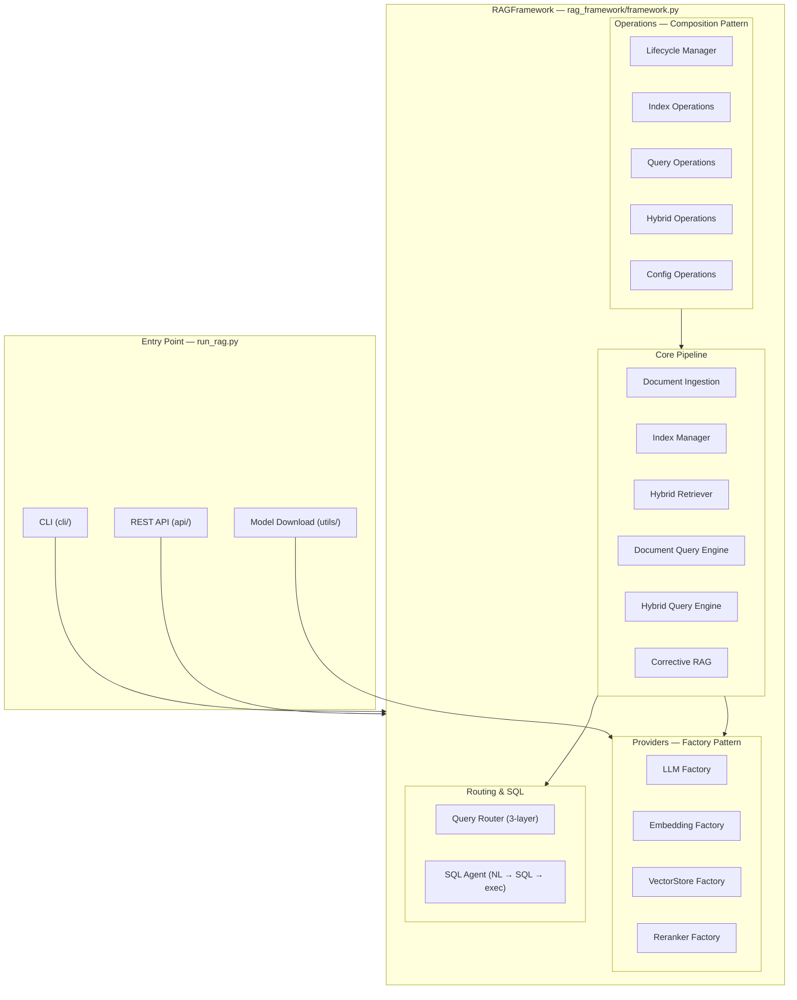
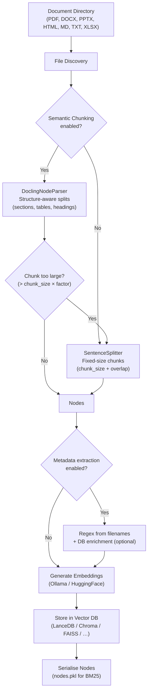
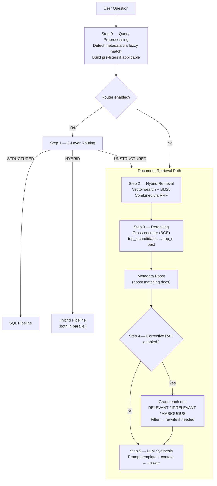
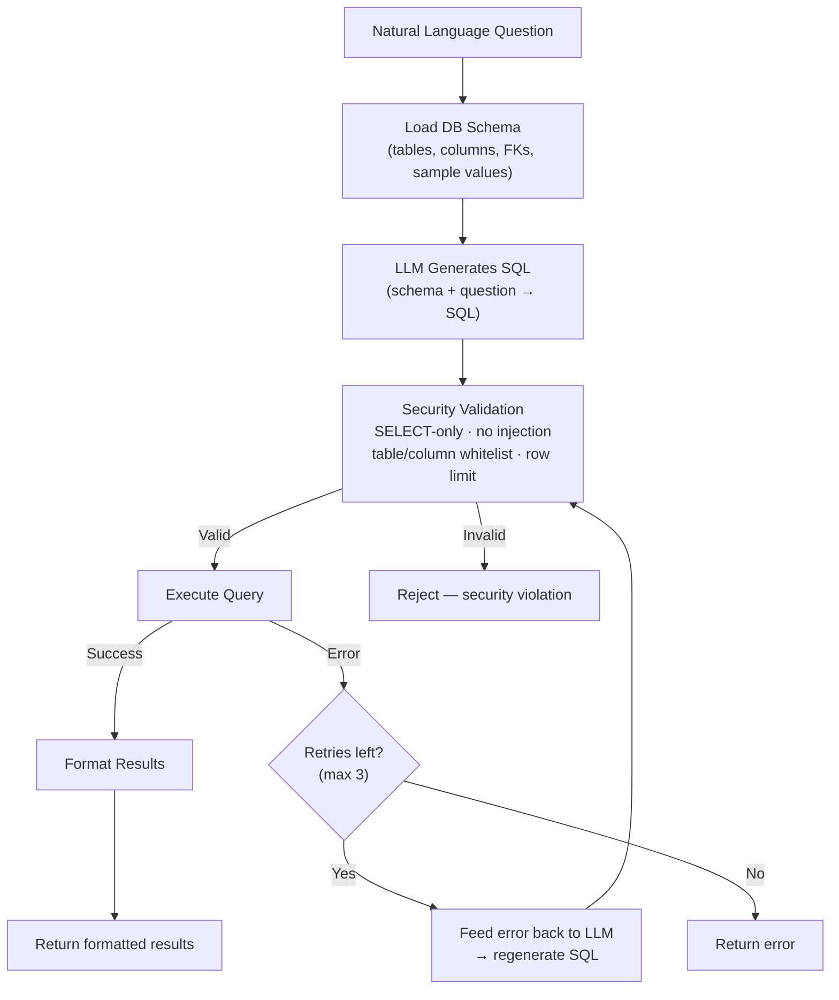
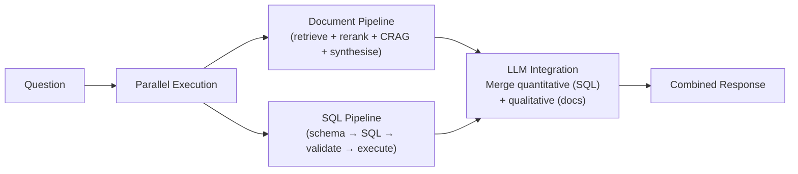
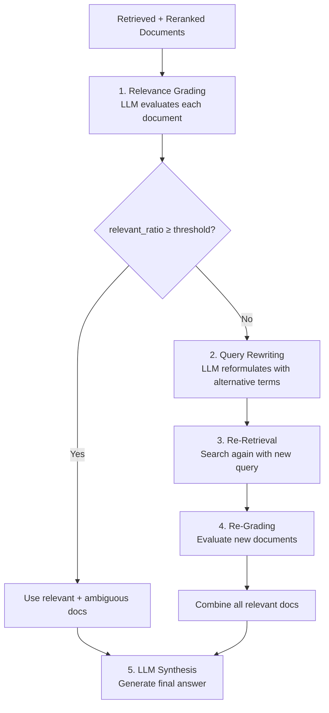

# Custom RAG Framework

> A modular, fully-local **Retrieval-Augmented Generation** framework that answers
> natural-language questions over **documents and SQL databases simultaneously**.
> Intelligent query routing, hybrid BM25 + vector retrieval, cross-encoder reranking,
> and Corrective RAG — all controlled by a single YAML file. Zero cloud dependency.

**Bachelor's Thesis (Trabajo de Fin de Grado) · Universidad de Sevilla · Python 3.10+ · LlamaIndex · LanceDB · Ollama**

---

## Table of Contents

1. [Overview](#overview)
2. [Key Features](#key-features)
3. [Architecture](#architecture)
4. [End-to-End Data Flow](#end-to-end-data-flow)
5. [How It Works](#how-it-works)
   - [Document Ingestion Pipeline](#document-ingestion-pipeline)
   - [Query Processing Pipeline](#query-processing-pipeline)
   - [SQL Query Pipeline](#sql-query-pipeline)
   - [Hybrid Query Pipeline](#hybrid-query-pipeline)
6. [Corrective RAG](#corrective-rag)
7. [Prerequisites](#prerequisites)
8. [Installation](#installation)
9. [Quick Start](#quick-start)
10. [Configuration](#configuration)
    - [Full Configuration Reference](#full-configuration-reference)
    - [Metadata Extraction](#metadata-extraction)
    - [Ready-to-Use Configurations](#ready-to-use-configurations)
11. [CLI Mode](#cli-mode)
12. [REST API](#rest-api)
13. [Python Library](#python-library)
14. [Model Download](#model-download)
15. [Demos](#demos)
16. [Testing & Evaluation](#testing--evaluation)
17. [Troubleshooting](#troubleshooting)
18. [Repository Structure](#repository-structure)
19. [UI — Demo Layer](#ui--demo-layer)
20. [Tech Stack](#tech-stack)
21. [Future Roadmap](#future-roadmap)

---

## Overview

This repository contains a production-grade RAG engine built as a Final Degree Project.
The research question it addresses is: *how do you build a single system that can
intelligently retrieve answers from both unstructured documents and a structured SQL
database, routing each query to the right source automatically — and reduce hallucinations
along the way?*

The answer is a layered pipeline. A **3-layer query router** classifies each question
as belonging to documents, a SQL database, or both — without user tagging. For document
queries, **hybrid BM25 + vector retrieval** with Reciprocal Rank Fusion maximises recall
while a **BGE cross-encoder reranker** sharpens precision before the LLM sees any context.
An optional **Corrective RAG** step grades every retrieved chunk for relevance, discards
noise, and rewrites the query if coverage falls below a configurable threshold. For SQL
queries, an **NL-to-SQL agent** generates safe, validated SQL from natural language with
up to three self-correction retries on failure.

Every component — LLM provider, embedding model, vector store, reranker, SQL connection,
chunking strategy, routing thresholds, prompt template — is controlled by a **single YAML
file**. Swapping providers or tuning the pipeline requires no code changes.

Three interfaces are provided: an **interactive CLI** with a configuration wizard,
a **session-isolated REST API** for integration, and a direct **Python library**
for embedding the framework into other applications.

A Next.js chat interface (`ui/`) is included as a **demo/integration layer** that exposes
the framework through a browser. It is not the core contribution; the RAG engine is.

The following video presents a complete demo: from theme introduction to an overview of the three project interfaces. The video is currently in Spanish (as it was intended to present the functionalities to my research team). An English version is currently being prepared.

NOTE: Clicking in the image will open the video on `youtube.com`

<a href="https://youtu.be/rBVghMyY3ao" target="_blank">
  
</a>

---

## Key Features

| Category | Supported Options |
|---|---|
| **LLM Providers** | Ollama (local) · HuggingFace (local/remote) |
| **Embedding Providers** | Ollama · HuggingFace (sentence-transformers, BGE, …) |
| **Vector Stores** | LanceDB · Chroma · FAISS · Qdrant · Pinecone |
| **Retrieval** | Vector (semantic) · BM25 (lexical) · Hybrid (both with RRF) |
| **Reranking** | FlagEmbedding cross-encoder (BGE-reranker-base / large / v2-m3) · Ollama |
| **SQL Databases** | SQLite · PostgreSQL · MySQL — natural language → SQL |
| **Query Router** | 3-layer automatic classification: documents, SQL, or hybrid |
| **Corrective RAG** | LLM-based relevance grading + automatic query rewriting — toggleable |
| **Document Formats** | PDF · DOCX · PPTX · HTML · Markdown · TXT · XLSX · CSV (via Docling) |
| **Chunking** | Semantic (Docling-aware, structure-preserving) · Fixed-size (SentenceSplitter) |
| **Metadata** | Regex extraction from filenames · DB enrichment · query-time filtering |
| **Prompt Templates** | Spanish · English · multilingual — 11 built-in, custom supported |
| **Interfaces** | Interactive CLI · REST API (session-isolated) · Python library |

---

## Architecture

```
User input
    │
    ▼
┌─────────────────────┐
│  QueryPreprocessor  │  Fuzzy metadata detection, pre-filter construction
└──────────┬──────────┘
           │
           ▼
┌─────────────────────┐
│   3-Layer Router    │  Keywords → LLM classifier → post-execution fallback
└───┬─────────┬───────┘
    │         │         │
    │ DOCS    │ SQL     │ HYBRID
    ▼         │         │
┌──────────┐  │    ┌────▼────────────────┐
│  Hybrid  │  │    │ Both paths run in   │
│ Retrieval│  │    │ parallel, LLM merges│
│BM25+Vec  │  │    │ quantitative +      │
│   RRF    │  │    │ qualitative evidence│
│ Reranker │  │    └─────────────────────┘
│  (BGE)   │  │
│ CRAG opt.│  ▼
└────┬─────┘ ┌──────────────┐
     │       │  SQL Agent   │
     │       │ NL→SQL→Valid │
     │       │ →Execute     │
     │       └──────┬───────┘
     │              │
     └──────┬───────┘
            │
            ▼
     LLM Synthesis
            │
            ▼
       Final Response
```

The framework follows a **composition pattern**: `RAGFramework` (`rag/rag_framework/framework.py`)
delegates to five specialised operation managers (lifecycle, index, query, hybrid, config).
Components are created via the **factory pattern**, making every provider interchangeable
at configuration time without modifying source code.

<details>
<summary>Expand: full Mermaid architecture diagram</summary>



</details>

---

## End-to-End Data Flow

This view traces the complete runtime path from user input to final response:

```
User input (CLI / API / Python library)
  │
  └─► QueryPreprocessor
        - detect metadata values via fuzzy matching (stopword-filtered)
        - construct metadata pre-filters if applicable
        │
        └─► Router (if enabled)
              Layer 0: manual override tags → forced source for testing
              Layer 1: keyword rules (fast path, no LLM call)
              Layer 2: LLM classification (fallback for ambiguous queries)
              Layer 3: post-execution fallback on empty results
              │
              ├─► UNSTRUCTURED path
              │     retrieve (vector + BM25) → RRF fuse → rerank
              │     → optional Corrective RAG → LLM synthesise
              │
              ├─► STRUCTURED path
              │     load schema → NL-to-SQL → validate → execute → format
              │
              └─► HYBRID path
                    run UNSTRUCTURED + STRUCTURED in parallel
                    → LLM integrates quantitative + qualitative evidence
```

Each query follows a different path while sharing a common contract:
configuration-driven behaviour, reproducible routing decisions, and
a consistent response interface.

---

## How It Works

### Document Ingestion Pipeline

When `ingest()` is called the framework executes the following pipeline:



**Step by step:**

1. **File Discovery** — The framework scans the configured documents directory for all
   supported file types.
2. **Document Parsing** — [Docling](https://github.com/DS4SD/docling) handles PDF, DOCX,
   PPTX, HTML, Markdown, and XLSX with structure preservation. A `SimpleDirectoryReader`
   fallback is used for TXT and JSON.
3. **Chunking** — Two strategies available:
   - **Semantic chunking** (default): `DoclingNodeParser` splits documents respecting
     their internal structure (sections, tables, headings). Chunks exceeding
     `chunk_size × semantic_oversized_factor` are re-split by `SentenceSplitter`.
   - **Fixed-size chunking**: `SentenceSplitter` divides text into chunks of `chunk_size`
     tokens with `chunk_overlap` overlap.
4. **Metadata Extraction** *(optional)* — Regex patterns extract structured metadata from
   filenames. Extracted codes can be enriched by SQLite lookup.
5. **Embedding Generation** — Each chunk is converted to a dense vector using the
   configured embedding model.
6. **Storage** — Vectors are persisted in the configured vector store. Original nodes are
   serialised to `nodes.pkl` for BM25 lexical search.

---

### Query Processing Pipeline



#### Step 0: Query Preprocessing

Before any retrieval, the `QueryPreprocessor` analyses the question for metadata values
that match known fields (e.g. subject names, department codes). It applies fuzzy matching
with stopword filtering and Roman↔Arabic numeral expansion. If matches are found, metadata
pre-filters are created to narrow retrieval scope.

#### Step 1: 3-Layer Routing

| Layer | Mechanism | When It Fires |
|---|---|---|
| **Layer 0 — Manual Override** | Explicit tags in the query text | When override tags are present (testing) |
| **Layer 1 — Keyword Rules** | Fast pattern matching, no LLM call | When confidence ≥ `keyword_confidence_threshold` |
| **Layer 2 — LLM Classification** | LLM receives query + schema summary and classifies it | When Layer 1 is inconclusive |
| **Layer 3 — Post-Execution Fallback** | If primary source returns 0 results, retry with alternative | After execution, when results are empty |

Routing outputs one of three decisions: `UNSTRUCTURED` · `STRUCTURED` · `HYBRID`.

**Decision tree (deterministic order):**

```
Start
 → Layer 0: manual override tag present?
     yes: return forced source
     no: continue
 → Layer 1: keyword classifier confidence ≥ threshold?
     yes: return keyword source
     no: continue
 → Layer 2: LLM classifier confidence ≥ llm_threshold?
     yes: return LLM source
     no: return default_source from router config
 → Execute selected source
 → Layer 3: empty result and fallback_on_empty=true?
     yes: execute fallback strategy (try_sql / try_unstructured / try_hybrid)
     no: finalise
```

Layer 1 resolving early avoids an LLM call entirely, keeping routing near-constant time
for unambiguous queries.

#### Step 2: Hybrid Retrieval

Two retrieval strategies run in parallel and their results are fused:

- **Vector Search** — finds the `top_k` most semantically similar chunks using the
  embedding model.
- **BM25 (Lexical Search)** — finds the `top_k` best keyword-matching chunks using
  term frequency.

Results are combined via **Reciprocal Rank Fusion (RRF)**:

$$\text{score}(d) = \alpha \cdot \frac{1}{k + \text{rank}_{\text{vec}}(d)} + (1 - \alpha) \cdot \frac{1}{k + \text{rank}_{\text{bm25}}(d)}$$

Where `α` controls the balance (0 = BM25 only, 1 = vector only, 0.5 = equal weight).
When `use_hybrid_search` is disabled, only vector search is used.

#### Step 3: Reranking

A cross-encoder model (BGE-reranker) re-scores all retrieved chunks by directly comparing
each chunk against the full query. This produces a more accurate relevance ranking than
embedding similarity alone. The top `top_n` chunks are kept for synthesis.

---

### SQL Query Pipeline



**SQL security model — defence in depth:**

| Threat | Example | Control |
|---|---|---|
| Destructive statements | `DROP TABLE users` | Non-SELECT statements rejected by validator |
| Tautology injection | `... OR 1=1` | Validation + LLM regeneration loop |
| Oversized extraction | `SELECT * FROM huge_table` | `max_rows` cap at execution level |
| Schema probing | queries over unknown tables | Table/column whitelist checks |
| Repeated malformed SQL | syntax or semantic errors | Bounded retries with explicit failure |

> This does not replace perimeter security. For production, place the API behind
> authentication, TLS, and rate controls.

---

### Hybrid Query Pipeline



The `HybridQueryEngine` runs both pipelines in parallel and feeds the combined results to
the LLM for an integrated response. If one source returns no results, the fallback strategy
determines whether to retry with the other source.

---

## Corrective RAG

**Corrective RAG (CRAG)** adds an LLM-based relevance evaluation step between retrieval
and synthesis. Its goal is to ensure only truly relevant documents reach the LLM,
improving answer quality and reducing hallucinations.

> Reference: Yan et al., *"Corrective Retrieval Augmented Generation"* (2024).

### Activation

```yaml
corrective_rag:
  enabled: true
  relevance_threshold: 0.5   # minimum ratio of relevant docs before rewriting
  max_retries: 1             # query rewrite attempts (0 = grading only, no rewrite)
```

### Pipeline



**Grading outcomes per document:**

| Grade | Meaning | Action |
|---|---|---|
| **RELEVANT** | Directly useful information | Kept |
| **AMBIGUOUS** | Tangentially related | Kept (benefit of the doubt) |
| **IRRELEVANT** | No useful information | Discarded |

**Configuration parameters:**

| Parameter | Type | Default | Description |
|---|---|---|---|
| `enabled` | bool | `false` | Toggle Corrective RAG on/off |
| `relevance_threshold` | float | `0.5` | Minimum ratio of relevant docs to skip rewriting (0.0–1.0) |
| `max_retries` | int | `1` | Maximum query rewrite + re-retrieval attempts. `0` = grading only |

**Performance considerations:**

CRAG adds one grading LLM call per retrieved chunk plus one optional rewrite call.
With `top_n=7`, this adds ~7–8 extra LLM calls per query. Enable CRAG when answer quality
is prioritised over speed, or when the document corpus is heterogeneous and retrieval may
return tangentially related content.

**Sample debug output:**

```
[INFO] [CRAG] Evaluating relevance of 7 documents...
[INFO] [CRAG] Evaluation: 5 relevant, 1 irrelevant, 1 ambiguous out of 7
[INFO] [CRAG] Result: 6 relevant documents kept

# When rewriting is triggered:
[INFO] [CRAG] Relevance ratio (0.14) below threshold (0.50). Rewriting query...
[INFO] [CRAG] Rewritten query: 'opening hours customer service office'
[INFO] [CRAG] Re-retrieval: 7 documents → 8 relevant total after merge
```

---

## Prerequisites

- **Python** 3.10 or higher
- **Ollama** installed and running (required for the default configuration)
  - Download from [ollama.com](https://ollama.com)
  - Pull the default models:
    ```bash
    ollama pull qwen3:8b
    ollama pull bge-m3:latest
    ```
- **NVIDIA GPU with CUDA** *(optional)* — accelerates HuggingFace local models and the
  BGE cross-encoder reranker

---

## Installation

```bash
# 1. Clone the repository
git clone <repository-url>
cd <repository>

# 2. Set up a Python environment
conda create -n rag-env python=3.11
conda activate rag-env

# 3. Install dependencies
cd rag
pip install -r requirements.txt
```

> If you have a CUDA-capable GPU, install PyTorch with CUDA support before
> `pip install -r requirements.txt`:
> ```bash
> pip install torch --index-url https://download.pytorch.org/whl/cu128
> ```

**Core dependencies:**

| Package | Version | Purpose |
|---|---|---|
| `llama-index` | ≥ 0.12.0 | Core RAG engine |
| `lancedb` | ≥ 0.13.0 | Default local vector store |
| `docling` | ≥ 2.15.0 | Advanced document parsing (PDF, DOCX, PPTX, HTML, XLSX) |
| `sentence-transformers` | ≥ 3.0.0 | HuggingFace embedding models |
| `FlagEmbedding` | ≥ 1.3.0 | Cross-encoder reranking |
| `torch` | ≥ 2.2.0 | Backend for HuggingFace models |
| `SQLAlchemy` | ≥ 2.0.0 | SQL database abstraction |
| `pyyaml` | ≥ 6.0.0 | YAML configuration loading |

---

## Quick Start

All commands below assume you are inside the `rag/` directory:

```bash
cd rag
conda activate rag-env
```

### Option A: Interactive CLI

```bash
python run_rag.py cli
# → Select "Default configuration"
# → Option 1: Ingest documents  (place files in ./documents/)
# → Option 2: Start chatting
```

### Option B: REST API

```bash
# Terminal 1 — start the server
python run_rag.py api

# Terminal 2 — verify it is running
curl http://localhost:8765/health
```

### Option C: Python Library

```python
from rag_framework import RAGFramework

# Use default configuration
rag = RAGFramework()
rag.ingest()                              # index ./documents/
print(rag.query("What is X about?"))

# Load a custom configuration
rag = RAGFramework.from_yaml("config/sql_hybrid.yaml")
```

---

## Configuration

All pipeline behaviour is controlled by a single YAML file.
The default is `rag/config/rag_config.yaml`.

### Full Configuration Reference

```yaml
# ── LLM ──────────────────────────────────────────────────────────────────────
llm:
  provider: ollama              # ollama | huggingface
  model: qwen3:8b
  base_url: "http://localhost:11434"

  # HuggingFace alternative:
  # provider: huggingface
  # hf_model_id: "meta-llama/Llama-2-7b-chat-hf"
  # local_model_path: "./models/llm/TinyLlama--TinyLlama-1.1B-Chat-v1.0"
  # device: auto

  context_window: 8192
  temperature: 0.0              # 0 = deterministic output
  top_p: 0.9
  top_k: 40
  max_tokens: 1024
  repeat_penalty: 1.1
  request_timeout: 300.0
  thinking: false               # disable chain-of-thought tokens (reduces latency)
  stop_sequences:
    - "\n\nQuestion:"
    - "\n\nUser:"

# ── Embeddings ───────────────────────────────────────────────────────────────
embedding:
  provider: ollama              # ollama | huggingface
  model: bge-m3:latest          # multilingual, 1024 dims
  base_url: "http://localhost:11434"

  # HuggingFace alternative:
  # provider: huggingface
  # hf_model_id: "sentence-transformers/all-MiniLM-L6-v2"
  # device: auto

  # Note: changing the embedding model requires re-indexing all documents.

# ── Vector Store ─────────────────────────────────────────────────────────────
vector_store:
  provider: lancedb             # lancedb | chroma | faiss | qdrant | pinecone
  persist_directory: "./vector_store"
  collection_name: documents
  lance_mode: overwrite         # overwrite | append

# ── Chunking ─────────────────────────────────────────────────────────────────
chunking:
  chunk_size: 1536
  chunk_overlap: 200
  use_semantic_chunking: true   # DoclingNodeParser — structure-preserving
  semantic_oversized_factor: 1.5 # chunks > chunk_size × 1.5 are re-split

# ── Retrieval ─────────────────────────────────────────────────────────────────
retrieval:
  use_hybrid_search: true       # BM25 + vector with RRF fusion
  top_k: 15                     # candidates entering the reranker
  alpha: 0.5                    # 0 = BM25 only  ·  1 = vector only
  rrf_k: 80                     # RRF smoothing constant

  reranker:
    enabled: true
    provider: huggingface       # huggingface | ollama
    model: BAAI/bge-reranker-v2-m3
    local_model_path: "./models/bge-reranker-v2-m3"
    device: auto                # auto | cuda | cpu
    top_n: 7                    # chunks reaching the LLM after reranking

# ── Directories ───────────────────────────────────────────────────────────────
directories:
  documents_dir: "./documents"
  vector_store_dir: "./vector_store"

# ── Prompt Template ───────────────────────────────────────────────────────────
# Built-in templates:
#   Spanish  : default, conversational_es, academic_es, summary_es
#   English  : default_en, conversational_en, academic_en, code_assistant_en
#   Neutral  : strict_factual, chain_of_thought, comparison
prompt_template: default

# Custom prompt (set prompt_template: custom):
# custom_prompt: |
#   Answer strictly from the context below.
#   Context: {context_str}
#   Question: {query_str}
#   Answer:

# ── Debug ─────────────────────────────────────────────────────────────────────
debug: false   # logs retrieved chunks, scores, and routing decisions

# ── SQL ───────────────────────────────────────────────────────────────────────
sql:
  enabled: true
  connection:
    db_type: sqlite             # sqlite | postgresql | mysql
    sqlite_path: "./data/my_database.db"
    pool_size: 5
    query_timeout: 30.0
  schema:
    include_tables: []          # [] = all tables
    exclude_tables: []
    include_sample_values: true
    sample_values_limit: 5
    include_relationships: true
  security:
    allow_only_select: true     # enforce read-only access
    max_rows: 100               # cap on rows returned per query
    max_execution_time: 30.0
  max_retries: 3                # LLM self-correction attempts on SQL failure

# ── Query Router ──────────────────────────────────────────────────────────────
router:
  enabled: true
  default_source: unstructured  # unstructured | structured | hybrid

# ── Corrective RAG ────────────────────────────────────────────────────────────
corrective_rag:
  enabled: false
  relevance_threshold: 0.5     # min ratio of relevant docs before rewriting
  max_retries: 1               # 0 = grading only, no query rewrite

# ── Metadata Extraction ───────────────────────────────────────────────────────
# metadata:
#   enabled: true
#   filename_patterns:
#     - pattern: "^(?P<dept>\\w+)_(?P<subject>\\w+)_(?P<year>\\d{4})"
#   db_enrichment:
#     enabled: true
#     db_path: "./data/academic.db"
#     table: subjects
#     key_column: code
#     value_column: name
#   filtering:
#     enabled: true
```

### Metadata Extraction

The framework can extract structured metadata from document filenames and use it to
narrow retrieval at query time — without any changes to the query text.

```yaml
metadata:
  enabled: true
  filename_patterns:
    - pattern: "^(?P<dept>\\w+)_(?P<subject>\\w+)_(?P<year>\\d{4})"
      # e.g. "Ingenieria_AI001_2024.pdf" → dept=Ingenieria, subject=AI001, year=2024
  db_enrichment:
    enabled: true               # optional: resolve codes to human-readable names
    db_path: "./data/academic.db"
    table: subjects
    key_column: code
    value_column: name          # AI001 → "Artificial Intelligence"
  filtering:
    enabled: true
```

**How it works:**

1. **Filename regex** — Named capture groups extract structured fields at ingestion time.
2. **DB enrichment** *(optional)* — Extracted codes are resolved to display names via a
   SQLite lookup (e.g. `AI001` → `"Artificial Intelligence"`).
3. **Query-time filtering** — The `QueryPreprocessor` detects metadata values mentioned
   in the user's question using fuzzy matching (with stopword filtering and Roman↔Arabic
   numeral expansion) and creates pre-filters that narrow retrieval before any embedding
   lookup.

### Ready-to-Use Configurations

The `rag/config/` directory contains ready-to-use configurations:

| File | Description |
|---|---|
| `rag_config.yaml` | **Default** — Ollama (qwen3:8b + bge-m3) · LanceDB · hybrid search · reranker · SQL · router |
| `huggingface.yaml` | HuggingFace models instead of Ollama (GPU recommended) |
| `local_models.yaml` | Fully offline — locally downloaded HuggingFace models |
| `chroma.yaml` | ChromaDB as vector store instead of LanceDB |
| `sql_hybrid.yaml` | SQL + hybrid routing fully configured |
| `proyectos_docentes.yaml` | Domain example — hybrid (documents + SQL) |
| `proyectos_docentes_solo_rag.yaml` | Domain example — documents only |
| `proyectos_docentes_solo_sql.yaml` | Domain example — SQL only |
| `rtx4060_candidates.yaml` | Optimised model candidates for RTX 4060 (8 GB VRAM) |

**Loading a custom configuration:**

```bash
# CLI
python run_rag.py cli
# → "Load from YAML file" → select file

# API
python run_rag.py api --config config/huggingface.yaml

# Python
rag = RAGFramework.from_yaml("config/local_models.yaml")
```

---

## CLI Mode

```bash
cd rag
python run_rag.py          # default (same as 'cli')
python run_rag.py cli      # explicit
```

### Startup: Choose Configuration

On launch, three options are presented:

1. **Default configuration** — Loads `config/rag_config.yaml` immediately.
2. **Configuration wizard** — Interactive step-by-step wizard to customise each
   component: LLM, embeddings, reranker, vector store, SQL, prompt template, directories.
3. **Load from YAML file** — Select any existing `.yaml` from the `config/` directory.

### Main Menu

Once configured, the main menu provides 11 operations:

```
╔════════════════════════════════════════╗
║            MAIN MENU                   ║
╠════════════════════════════════════════╣
║  1. Ingest documents                   ║
║  2. Interactive chat mode              ║
║  3. Single query                       ║
║  4. Validate models                    ║
║  5. List prompt templates              ║
║  6. Show configuration                 ║
║  7. Edit configuration                 ║
║  8. Save configuration                 ║
║  9. Functionalities [X/5 active]       ║
║ 10. Download models                    ║
║ 11. Launch API server                  ║
║  0. Exit                               ║
╚════════════════════════════════════════╝
```

| Option | Description |
|---|---|
| **1 — Ingest** | Scans documents directory, chunks, embeds, and writes the vector index |
| **2 — Chat** | Multi-turn interactive conversation (auto-ingests if no index exists) |
| **3 — Single query** | One question → answer with full pipeline trace |
| **4 — Validate models** | Checks that the configured LLM and embedding models are reachable |
| **5 — Templates** | Lists all built-in prompt templates with previews |
| **6 — Show config** | Displays a structured summary of the active configuration |
| **7 — Edit config** | Modify individual components at runtime (no restart needed) |
| **8 — Save config** | Export the current configuration to a YAML file |
| **9 — Functionalities** | Toggle 5 pipeline features live: **Corrective RAG** · **SQL Router** · **Hybrid Search** · **Reranker** · **Debug Mode** |
| **10 — Download** | Download HuggingFace models for offline use |
| **11 — API** | Launch the REST API server from within the CLI session |

---

## REST API

```bash
cd rag
python run_rag.py api                                   # port 8765 (default)
python run_rag.py api --port 8080                       # custom port
python run_rag.py api --config config/sql_hybrid.yaml  # custom config
```

The server binds to `0.0.0.0:8765`. Each **session** has its own isolated document
directory and vector store — multiple clients can run concurrently without interference.

### Endpoints

| Method | Path | Description |
|---|---|---|
| `GET` | `/health` | Server status, version, and active session count |
| `GET` | `/config` | Active LLM, embedding, and retrieval settings |
| `GET` | `/configs` | List available YAML configuration files |
| `POST` | `/sessions` | Create or retrieve a session (with optional config override) |
| `POST` | `/ingest` | Ingest documents into a session (base64-encoded) |
| `POST` | `/query` | Execute a RAG query against a session |
| `POST` | `/clear` | Delete a session and all its data |

### HTTP Status Codes

| Code | Meaning |
|---|---|
| `200` | Success (health, config reads, query/ingest completed) |
| `201` | Created (new session via `POST /sessions`) |
| `400` | Bad request — missing or invalid fields |
| `404` | Not found — unknown endpoint, missing session or config |
| `409` | Conflict — session already exists |
| `500` | Internal error — ingestion, query, or config failure |

### Request / Response Examples

#### Health check

```bash
curl http://localhost:8765/health
```

```json
{
  "status": "ok",
  "version": "1.1.0",
  "active_sessions": 2
}
```

#### Create a session

```bash
curl -X POST http://localhost:8765/sessions \
  -H "Content-Type: application/json" \
  -d '{"session_id": "my-session"}'
```

Override the LLM or configuration for this session:

```bash
curl -X POST http://localhost:8765/sessions \
  -H "Content-Type: application/json" \
  -d '{
    "session_id": "my-session",
    "config_name": "config/huggingface.yaml",
    "llm_model": "mistral-7b"
  }'
```

#### Ingest documents

```bash
# Encode a file and ingest it
B64=$(base64 -w 0 my_document.pdf)
curl -X POST http://localhost:8765/ingest \
  -H "Content-Type: application/json" \
  -d "{
    \"session_id\": \"my-session\",
    \"files\": [{\"name\": \"my_document.pdf\", \"content\": \"$B64\"}]
  }"
```

```json
{
  "success": true,
  "session_id": "my-session",
  "files_ingested": ["my_document.pdf"],
  "total_files": 1
}
```

#### Query

```bash
curl -X POST http://localhost:8765/query \
  -H "Content-Type: application/json" \
  -d '{"session_id": "my-session", "query": "What is the enrollment procedure?"}'
```

```json
{
  "success": true,
  "session_id": "my-session",
  "query": "What is the enrollment procedure?",
  "response": "According to the documents, the enrollment procedure consists of..."
}
```

#### Clear a session

```bash
curl -X POST http://localhost:8765/clear \
  -H "Content-Type: application/json" \
  -d '{"session_id": "my-session"}'
```

### Production Deployment Note

The current implementation targets local and development usage:
- No built-in authentication middleware.
- CORS is permissive (`Access-Control-Allow-Origin: *`).
- Session isolation is logical (per-session directories), not an access-control boundary.

For production, front the API with a reverse proxy that enforces: API key / JWT
authentication, HTTPS/TLS termination, rate limiting, and network-level allowlists.

---

## Python Library

The framework can be imported directly into any Python project.
Run scripts from the `rag/` directory (or add it to `sys.path`).

```python
from rag_framework import RAGFramework

# ── Default configuration ─────────────────────────────────────────────────────
rag = RAGFramework()
rag.ingest()                                  # index ./documents/
response = rag.query("What are the main topics?")
print(response)

# ── Load from YAML ────────────────────────────────────────────────────────────
rag = RAGFramework.from_yaml("config/huggingface.yaml")

# ── Directed queries (bypass the router) ─────────────────────────────────────
rag.query("general question")                 # auto-routed
rag.query_documents("explain the regulation") # documents only
rag.query_sql("how many users are there?")    # SQL only
rag.query_hybrid("sales data and trends")     # both sources

# ── Interactive terminal chat ─────────────────────────────────────────────────
rag.ingest()
rag.chat()

# ── Configuration and prompt management ──────────────────────────────────────
rag.set_prompt_template("conversational_en")
rag.set_custom_prompt(
    "Answer only from the context below.\n"
    "Context: {context_str}\nQuestion: {query_str}\nAnswer:"
)
rag.save_config("my_config.yaml")
rag.validate_models()

# ── Index lifecycle ───────────────────────────────────────────────────────────
rag.load_index()    # load a previously created index without re-ingesting
rag.clear_index()   # remove all indexed data
```

More examples in `rag/examples/usage_examples.py`.

---

## Model Download

Download HuggingFace models for fully offline operation:

```bash
cd rag

# Download by type and shortcut name
python run_rag.py download llm tiny-llama
python run_rag.py download embedding all-MiniLM-L6-v2
python run_rag.py download reranker bge-reranker-base

# Download by full HuggingFace model ID
python run_rag.py download llm meta-llama/Llama-2-7b-chat-hf --token YOUR_HF_TOKEN

# List available shortcuts
python run_rag.py download --list-popular

# Custom output directory
python run_rag.py download llm tiny-llama --output ./models/my-llm
```

**Popular model shortcuts:**

| Type | Shortcut | HuggingFace ID |
|---|---|---|
| LLM | `tiny-llama` | TinyLlama/TinyLlama-1.1B-Chat-v1.0 |
| LLM | `mistral-7b-instruct` | mistralai/Mistral-7B-Instruct-v0.2 |
| LLM | `phi-2` | microsoft/phi-2 |
| Embedding | `all-MiniLM-L6-v2` | sentence-transformers/all-MiniLM-L6-v2 |
| Embedding | `all-mpnet-base-v2` | sentence-transformers/all-mpnet-base-v2 |
| Reranker | `bge-reranker-base` | BAAI/bge-reranker-base |
| Reranker | `bge-reranker-large` | BAAI/bge-reranker-large |

Downloaded models are stored in `rag/models/` and referenced via `local_model_path`
in the YAML configuration.

---

## Demos

Three runnable demo scripts are provided in `rag/demos/`:

### REST API Walkthrough

```bash
cd rag
# Terminal 1
python run_rag.py api
# Terminal 2
python demos/demo_api_rest.py
```

Walks through all API endpoints sequentially: health check → config inspection →
session creation → document ingestion → query → session cleanup.

### Academic Use Case

```bash
cd rag
python demos/demo_proyectos_docentes.py
```

A real-world scenario using university course syllabi. Compares three modes:

1. **Documents-only** — qualitative questions (methodology, evaluation criteria, content).
2. **SQL-only** — quantitative queries ("How many elective courses are there?").
3. **Hybrid** — the router directs each query to the appropriate source automatically.

This demo illustrates why multi-source RAG matters: document search excels at qualitative
questions while SQL excels at quantitative ones. Hybrid mode handles both without the user
needing to specify which source to use.

---

## Testing & Evaluation

### Running Tests

```bash
cd rag
pytest                      # all tests
pytest tests/unit/          # unit tests only
pytest tests/integration/   # integration tests only
pytest -v --tb=short        # verbose output
```

**Test suite coverage:**

- **Unit tests** — config parsing, provider factories, SQL validation, router logic.
- **Integration tests** — full ingest → query → response pipeline.
- **Evaluation tests** — retrieval quality and SQL correctness metrics.

### Evaluation Framework

The project includes a supervised evaluation pipeline in `rag/validation/`:

```bash
cd rag

# Run the default evaluation suite
python validation/run_eval.py --run-id eval_v1

# Inspect results
python validation/inspect_run.py eval_v1
python validation/inspect_run.py eval_v1 --type sql
python validation/inspect_run.py eval_v1 --query-id s01
python validation/inspect_run.py eval_v1 --percentile 95
```

**Dataset (`rag/validation/dataset.json`):**

80 supervised queries across five types with expected routing decisions, source patterns,
and abstention labels:

| Partition | Queries | Purpose |
|---|---|---|
| `well_formed` | 48 | Measures the system's performance ceiling |
| `adversarial` | 32 | Reveals component-level limits |

| Query type | Description |
|---|---|
| `rag` | Answer lives in unstructured documents |
| `sql` | Answer lives in the structured SQL database |
| `hybrid` | Requires combining evidence from both sources |
| `negative` | System must abstain (information not in the corpus) |
| `out_of_domain` | Completely outside the domain |

Each evaluation run produces `validation/runs/<run-id>/events.jsonl` with per-query
latency broken down by pipeline phase (embedding, BM25, vector, RRF, reranker,
synthesis), routing decisions with confidence scores, and CRAG grading details.

---

## Troubleshooting

| Symptom | Likely Cause | Action |
|---|---|---|
| Query returns empty answer | No index loaded or retrieval too restrictive | Re-run ingestion, verify `top_k`, disable strict metadata filters |
| SQL path fails repeatedly | Schema mismatch or unsupported SQL pattern | Inspect schema, reduce query ambiguity, check `max_retries` |
| Router chooses wrong source | Keyword lists or thresholds not tuned | Adjust `keyword_confidence_threshold`, review keyword dictionaries, test with manual override tags |
| Very slow responses | CRAG + reranker + large model active simultaneously | Profile with `debug: true`, try CRAG off, reduce `top_k`, use a lighter model |
| API works locally but fails from browser | CORS / proxy / auth mismatch | Validate reverse proxy headers and CORS configuration |
| Embedding model mismatch on load | Changed embedding model without re-indexing | Run `clear_index()` then `ingest()` with the new model |

**Suggested debugging workflow:**

1. Reproduce in CLI first (`run_rag.py cli`) to isolate transport issues.
2. Enable `debug: true` in the config and capture the full pipeline logs.
3. Use **Option 4 — Validate models** in the CLI to confirm model connectivity.
4. Re-run the same query via API to compare behaviour.

---

## Repository Structure

```
.
├── rag/                            ← CORE FRAMEWORK (Python)
│   ├── run_rag.py                  #   Unified entry point: CLI · API · model download
│   ├── requirements.txt
│   ├── pytest.ini
│   │
│   ├── rag_framework/              #   Core engine
│   │   ├── framework.py            #     RAGFramework — public facade
│   │   ├── exceptions.py
│   │   ├── validators.py
│   │   ├── config/                 #     Pydantic config models + YAML loader
│   │   │   ├── rag_config.py       #       Root RAGConfig (typed + validated)
│   │   │   ├── loader.py           #       YAML → dataclass resolution
│   │   │   └── …                   #       LLM, embedding, retrieval, SQL, CRAG configs
│   │   ├── core/                   #     Pipeline engines
│   │   │   ├── ingestion.py        #       Document loading and chunking (Docling)
│   │   │   ├── indexing.py         #       Vector index creation and management
│   │   │   ├── retrieval.py        #       Hybrid retriever (vector + BM25 + RRF)
│   │   │   ├── query_engine.py     #       Document query engine
│   │   │   ├── hybrid_engine.py    #       Multi-source hybrid query engine
│   │   │   ├── corrective_rag.py   #       CRAG: grading, rewriting, re-retrieval
│   │   │   └── query_preprocessor.py #     Metadata detection + pre-filters
│   │   ├── providers/              #     Factory pattern: LLM · embeddings · vector store · reranker
│   │   ├── routing/
│   │   │   └── router.py           #     3-layer query router
│   │   ├── sql/                    #     NL-to-SQL subsystem
│   │   │   ├── agent.py            #       SQL generation + retries
│   │   │   ├── validator.py        #       Security validation (SELECT-only, whitelist)
│   │   │   ├── executor.py         #       Safe query execution
│   │   │   └── schema.py           #       Schema extraction and description
│   │   ├── operations/             #     Composition managers
│   │   │   ├── lifecycle.py        #       Initialisation and factory methods
│   │   │   ├── index.py            #       Ingestion and index lifecycle
│   │   │   ├── query.py            #       Query routing and dispatch
│   │   │   ├── hybrid.py           #       Hybrid component initialisation
│   │   │   └── config.py           #       Configuration and prompt management
│   │   ├── prompts/
│   │   │   └── templates.py        #     11 built-in prompt templates (ES / EN / multilingual)
│   │   ├── interfaces/
│   │   │   └── chat.py             #     Interactive chat loop
│   │   ├── display/                #     Console formatting utilities
│   │   └── utils/                  #     Logging, constants, model downloader, device detection
│   │
│   ├── api/                        #   REST API server
│   │   ├── server.py               #     HTTP server bootstrap and routing
│   │   ├── handlers.py             #     Endpoint handlers (health, ingest, query, …)
│   │   ├── sessions.py             #     Session isolation manager
│   │   └── config_builder.py       #     Per-session config constructor
│   │
│   ├── cli/                        #   Interactive terminal interface
│   │   ├── menu/                   #     Menu controller and rendering
│   │   ├── handlers/               #     Business logic for each menu option
│   │   ├── wizards/                #     Configuration wizard (per-component)
│   │   ├── ui/                     #     Formatters and input helpers
│   │   └── discovery/              #     Discover local models, configs, databases
│   │
│   ├── config/                     #   Ready-to-use YAML configurations
│   ├── demos/                      #   Runnable demo scripts
│   ├── examples/                   #   Python usage examples
│   ├── scripts/                    #   Utility scripts (data prep, model download)
│   │   └── metrics/                #     Standalone evaluation scripts
│   ├── tests/                      #   Test suite
│   │   ├── unit/
│   │   ├── integration/
│   │   └── evaluation/
│   ├── validation/                 #   Supervised evaluation pipeline
│   │   ├── dataset.json            #     80-query annotated dataset
│   │   ├── run_eval.py             #     Evaluation runner
│   │   ├── inspect_run.py          #     Run inspection CLI
│   │   └── evaluation/             #     Metrics, judges, analysis, visualisation
│   └── docs/                       #   Supplementary documentation
│
└── ui/                             ← DEMO LAYER (Next.js 14)
    ├── app/                        #   Next.js app router (pages + API proxy routes)
    ├── components/                 #   React UI components (chat, sidebar, RAG panel)
    ├── lib/custom-rag/client.ts    #   TypeScript client for the RAG REST API
    ├── supabase/                   #   Auth and chat persistence (schema + migrations)
    └── package.json
```

---

## UI — Demo Layer

The `ui/` directory contains a Next.js 14 chat application that wraps the RAG framework
in a browser interface. It is provided as a demonstration of how the REST API can be
integrated into a production-quality frontend.

```
Browser → Next.js API routes → RAG REST API (localhost:8765)
```

**Features:** multi-provider LLM support (OpenAI, Anthropic, Google, Groq, Mistral, …),
Supabase authentication and conversation persistence, document upload panel, RAG
configuration panel, dark/light mode, internationalisation (18 languages).

**Running the UI:**

```bash
# 1. Start the RAG backend first
cd rag && python run_rag.py api

# 2. Install and configure the UI
cd ui
cp .env.local.example .env.local   # fill in Supabase keys
npm install
npm run chat                        # supabase start + Next.js dev server
```

Requires: Node v20, Supabase CLI, Docker (for local Supabase), Ollama running locally.

---

## Tech Stack

| Layer | Technology |
|---|---|
| **RAG engine** | [LlamaIndex](https://github.com/run-llama/llama_index) ≥ 0.12 |
| **LLM / embeddings** | [Ollama](https://ollama.com) (local) · HuggingFace Transformers |
| **Vector store** | [LanceDB](https://lancedb.github.io/lancedb/) (default) · Chroma · FAISS · Qdrant · Pinecone |
| **Reranker** | [FlagEmbedding](https://github.com/FlagOpen/FlagEmbedding) — BGE cross-encoder |
| **Document parsing** | [Docling](https://github.com/DS4SD/docling) — PDF · DOCX · PPTX · HTML · XLSX |
| **SQL abstraction** | SQLAlchemy — SQLite · PostgreSQL · MySQL |
| **Configuration** | Pydantic dataclasses + PyYAML |
| **Testing** | pytest + pytest-asyncio |
| **UI** | Next.js 14 · TypeScript · Supabase · Tailwind CSS · Radix UI |

---

## Future Roadmap

- **Chat history buffer** — Sliding window of recent turns with query condensing
  (Condense Question pattern), enabling multi-turn conversations with accumulated context.
- **RAGAS evaluation** — Integration with the RAGAS framework for faithfulness, answer
  relevancy, and context precision metrics beyond the current IR-focused evaluation.
- **Response streaming** — Token-by-token display instead of waiting for the complete
  response, reducing perceived latency.
- **Source citation** — Inline references in answers (e.g. `[1] document.pdf, p.23`)
  for full auditability of every claim.
