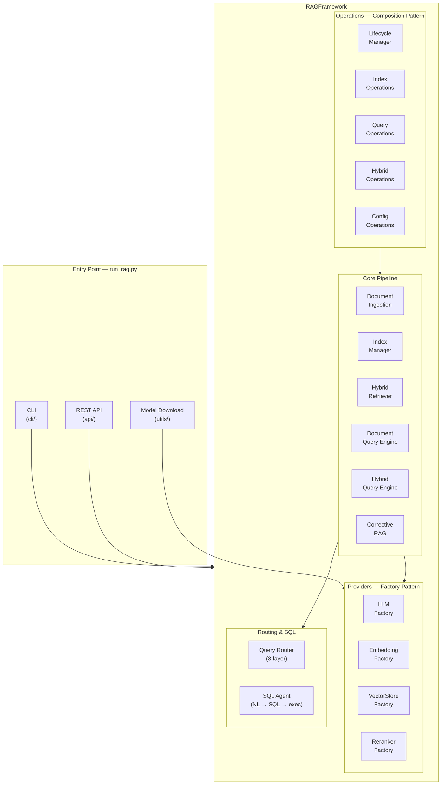
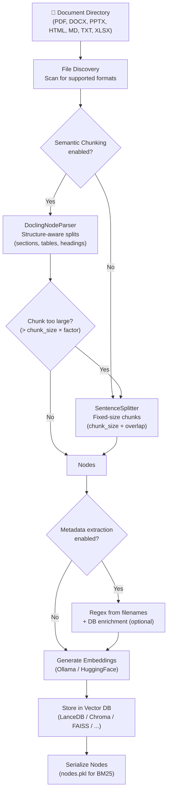
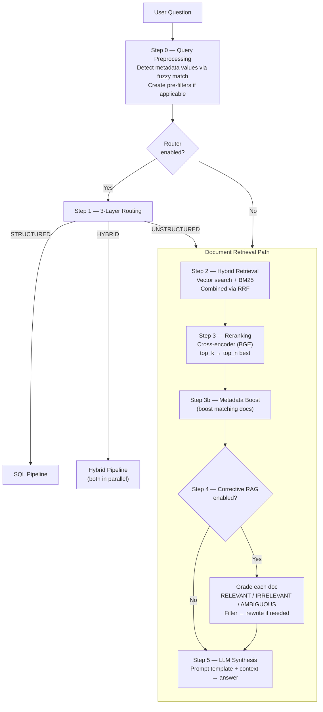
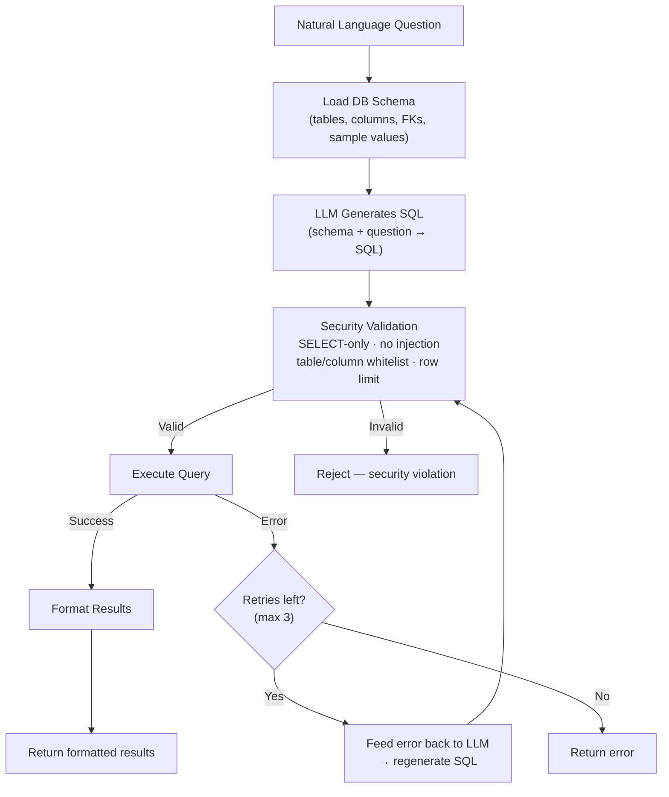
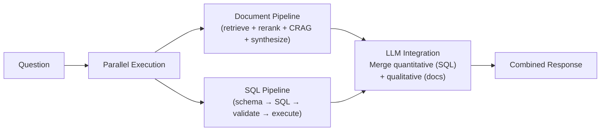
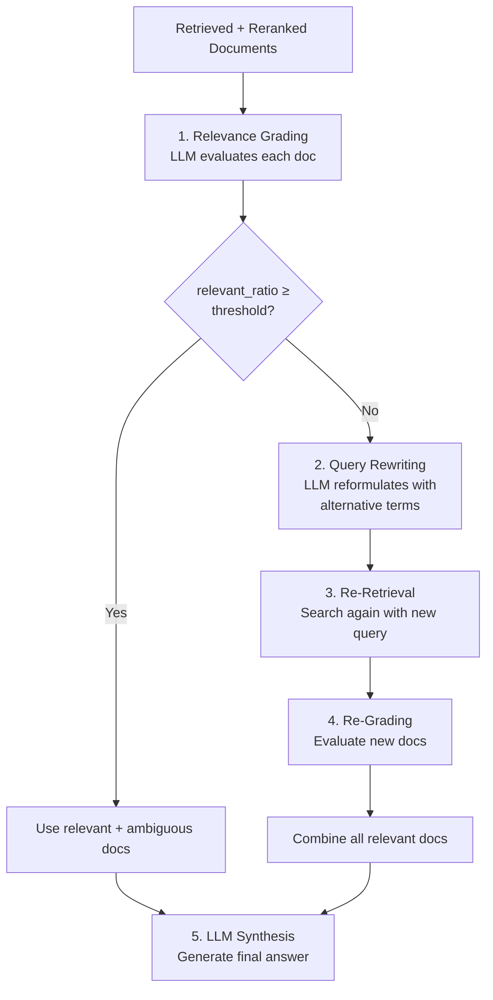

# Custom RAG Framework

> **Version 1.1.0** · Python 3.10+ · Final Degree Project (TFG)

A modular **Retrieval-Augmented Generation** framework that answers natural-language questions over **documents** and **SQL databases** simultaneously. It combines semantic search, lexical search (BM25), cross-encoder reranking, Corrective RAG, and intelligent query routing — all driven by a single YAML configuration file.

Three interfaces are provided: an **interactive CLI**, a **REST API** with session isolation, and a direct **Python library**.

---

## Table of Contents

1. [Overview](#overview)
2. [Key Features](#key-features)
3. [Architecture](#architecture)
4. [Unified End-to-End Data Flow](#unified-end-to-end-data-flow)
5. [Code-Level Traceability](#code-level-traceability)
6. [How It Works](#how-it-works)
   - [Document Ingestion Pipeline](#document-ingestion-pipeline)
   - [Query Processing Pipeline](#query-processing-pipeline)
   - [SQL Query Pipeline](#sql-query-pipeline)
   - [Hybrid Query Pipeline](#hybrid-query-pipeline)
7. [Corrective RAG](#corrective-rag)
8. [Prerequisites](#prerequisites)
9. [Installation](#installation)
10. [Quick Start](#quick-start)
11. [Configuration](#configuration)
   - [Configuration Reference](#configuration-reference)
   - [Metadata Extraction](#metadata-extraction)
   - [Example Configurations](#example-configurations)
12. [CLI Mode](#cli-mode)
13. [REST API](#rest-api)
14. [Python Library](#python-library)
15. [Model Download](#model-download)
16. [Demos](#demos)
17. [Project Structure](#project-structure)
18. [Troubleshooting](#troubleshooting)
19. [Benchmarking and Evaluation Protocol](#benchmarking-and-evaluation-protocol)
20. [TFG Writing Mapping](#tfg-writing-mapping)
21. [Testing](#testing)
22. [Future Roadmap](#future-roadmap)

---

## Overview

This framework was built as a Final Degree Project (Trabajo de Fin de Grado) to explore how a fully configurable RAG system can intelligently combine structured (SQL) and unstructured (document) data sources.

**What makes it different:**

- **Multi-source retrieval** — Queries can be answered from documents, a SQL database, or both, selected automatically or manually.
- **3-layer intelligent routing** — A cascade of keyword rules, LLM classification, and post-execution fallback decides the optimal data source for each query.
- **Corrective RAG** — An optional LLM-based grading step filters out irrelevant retrieved documents and rewrites the query when needed, reducing hallucinations.
- **Fully YAML-driven** — Every component (LLM, embeddings, vector store, reranker, SQL, router, chunking) is configured through a single YAML file. Swap providers or parameters without changing code.
- **Multiple interfaces** — Use the interactive CLI for exploration, the REST API for integration, or import the Python library directly.

---

## Key Features

| Category | Supported Options |
|---|---|
| **LLM Providers** | Ollama (local), HuggingFace (local/remote) |
| **Embedding Providers** | Ollama, HuggingFace (sentence-transformers, BGE, etc.) |
| **Vector Stores** | LanceDB, Chroma, FAISS, Qdrant, Pinecone |
| **Retrieval** | Vector (semantic), BM25 (lexical), or **Hybrid** (both with RRF) |
| **Reranking** | FlagEmbedding cross-encoder (BGE-reranker-base, large, v2-m3), Ollama |
| **SQL Databases** | SQLite, PostgreSQL, MySQL — natural-language to SQL |
| **Query Router** | 3-layer automatic query classification (documents, SQL, or hybrid) |
| **Corrective RAG** | LLM-based relevance grading, automatic query rewriting — toggleable |
| **Document Formats** | PDF, DOCX, PPTX, HTML, Markdown, TXT, XLSX, CSV (via Docling) |
| **Chunking** | Semantic (Docling-aware, structure-preserving) or fixed-size (SentenceSplitter) |
| **Metadata** | Regex extraction from filenames, DB enrichment, query-time filtering |
| **Prompt Templates** | Spanish, English, multilingual — customizable |
| **Interfaces** | Interactive CLI, REST API (with sessions), Python library |

---

## Architecture



The framework follows a **composition pattern**: `RAGFramework` delegates to five specialized operation managers. Providers are created via the **factory pattern**, allowing seamless swapping of LLMs, embeddings, vector stores, and rerankers.

---

## Unified End-to-End Data Flow

This view condenses the complete runtime behavior into a single trace from user input to final response.

```text
User input (CLI/API/Python)
  -> QueryPreprocessor
    - detect metadata matches (fuzzy)
    - build optional pre-filters
  -> Router (if enabled)
    Layer 0: manual override tags
    Layer 1: keyword rules (fast path)
    Layer 2: LLM classification (fallback)
    Layer 3: post-execution fallback on empty results
  -> Selected execution path
    A) UNSTRUCTURED:
     retrieve (vector + BM25) -> RRF fuse -> rerank -> optional CRAG -> synthesize
    B) STRUCTURED:
     schema load -> NL to SQL -> validate -> execute -> format
    C) HYBRID:
     run A and B in parallel -> integrate quantitative + qualitative evidence
  -> LLM synthesis using configured prompt template
  -> Response payload + source metadata (when available)
```

Operationally, this means each query can follow a different path while preserving a shared contract: configuration-driven behavior, reproducible routing decisions, and a consistent answer interface.

---

## Code-Level Traceability

This section links the conceptual flow to concrete modules and methods so the README can be used as a technical reference for formal TFG writing.

### Runtime Entry Points

| Interface | File | Primary Function | Responsibility |
|---|---|---|---|
| CLI / API / download multiplexer | `run_rag.py` | `main()` | Parses mode and dispatches to CLI, API server, or model download workflow |
| API server bootstrap | `api/server.py` | `run_server()` | Starts HTTP server and session manager |
| API HTTP handler | `api/handlers.py` | `RAGAPIHandler` methods | Implements `/health`, `/config`, `/configs`, `/ingest`, `/query`, `/clear`, `/sessions` |
| CLI interaction loop | `cli/menu/controller.py` | `show_startup_menu()`, `interactive_menu()` | Startup configuration selection and menu-driven execution |

### Orchestration Backbone

| Layer | File | Key Class / Method | Notes |
|---|---|---|---|
| Public facade | `rag_framework/framework.py` | `RAGFramework` | Stable public API used by CLI, API, and direct Python usage |
| Lifecycle wiring | `rag_framework/operations/lifecycle.py` | `initialize_from_config()`, `initialize_managers()` | Builds operation managers and provider dependencies |
| Index operations | `rag_framework/operations/index.py` | `ingest()`, `load_index()`, `clear_index()` | Document ingestion and persistent index lifecycle |
| Query operations | `rag_framework/operations/query.py` | `query()`, `query_documents_only()`, `query_sql()`, `query_hybrid()` | Main decision gateway for all query paths |
| Hybrid operations | `rag_framework/operations/hybrid.py` | manager initialization methods | Lazy initialization of router, SQL agent, and hybrid engine |
| Config operations | `rag_framework/operations/config.py` | prompt/config mutation helpers | Runtime prompt and config updates |

### Retrieval, Routing, and SQL Flow Anchors

| Concern | File | Main Anchors |
|---|---|---|
| Query preprocessing and metadata filters | `rag_framework/core/query_preprocessor.py` | query normalization and metadata pre-filter creation |
| Retrieval + ranking | `rag_framework/core/retrieval.py` | vector, BM25, and fusion logic |
| Corrective RAG | `rag_framework/core/corrective_rag.py` | relevance grading and query rewrite loop |
| Hybrid execution | `rag_framework/core/hybrid_engine.py` | parallel doc+SQL execution and response integration |
| Router logic | `rag_framework/routing/router.py` | layered route decision and confidence handling |
| NL-to-SQL | `rag_framework/sql/agent.py` | SQL generation, validation calls, execution retries |
| SQL safety validation | `rag_framework/sql/validator.py` | statement constraints and defensive checks |

### Configuration and Validation Anchors

| Scope | File | Key Role |
|---|---|---|
| Canonical config schema | `rag_framework/config/rag_config.py` | typed configuration model and defaults |
| YAML loading | `rag_framework/config/loader.py` | config parsing and resolution from file |
| Static validation | `rag_framework/validators.py` | model/provider/config consistency checks |

Traceability recommendation for TFG chapters: cite the conceptual section first (e.g., Query Processing), then cite these code anchors to justify implementation details.

---

## How It Works

This section explains the complete procedure the framework follows — from document ingestion to answer generation — so every step is transparent.

### Document Ingestion Pipeline

When `ingest()` is called, the framework executes the following pipeline:



**Step by step:**

1. **File Discovery** — The framework scans the configured documents directory for supported file types.
2. **Document Parsing** — [Docling](https://github.com/DS4SD/docling) handles PDF, DOCX, PPTX, HTML, Markdown, and XLSX with structure preservation. A `SimpleDirectoryReader` fallback is used for TXT and JSON files.
3. **Chunking** — Two strategies are available:
   - **Semantic chunking** (default): `DoclingNodeParser` splits documents respecting their internal structure (sections, tables, headings). Chunks that exceed `chunk_size × semantic_oversized_factor` are re-split by `SentenceSplitter`.
   - **Fixed-size chunking**: `SentenceSplitter` divides text into chunks of `chunk_size` tokens with `chunk_overlap` token overlap.
4. **Metadata Extraction** *(optional)* — Regex patterns extract structured metadata from filenames (e.g., department, subject code, year). Extracted codes can be enriched by looking up descriptions in a SQLite database.
5. **Embedding Generation** — Each chunk is converted to a dense vector using the configured embedding model.
6. **Storage** — Vectors are persisted in the configured vector store. Original nodes are serialized to `nodes.pkl` for BM25 lexical search.

**Result:** A persistent vector index and a serialized node file, ready for querying.

---

### Query Processing Pipeline

When the user submits a question, the framework processes it through a multi-stage pipeline. The exact path depends on whether routing is enabled.



**Detailed steps:**

#### Step 0: Query Preprocessing

Before any retrieval, the `QueryPreprocessor` analyzes the question looking for metadata values that match known fields (e.g., subject names, department codes). It uses fuzzy matching with stopword filtering and Roman↔Arabic numeral expansion. If matches are found, metadata pre-filters are created to narrow down retrieval.

#### Step 1: 3-Layer Routing

When the router is enabled, each query passes through up to three decision layers:

| Layer | Mechanism | When It Fires |
|-------|-----------|---------------|
| **Layer 0 — Manual Override** | Detects explicit tags in the query (for testing) | When override tags are present |
| **Layer 1 — Keyword Rules** | Fast pattern matching against configurable keyword lists (no LLM call) | When confidence ≥ `keyword_confidence_threshold` |
| **Layer 2 — LLM Classification** | LLM receives the query + DB schema summary and classifies it | When Layer 1 is inconclusive |
| **Layer 3 — Post-Execution Fallback** | If the primary source returns 0 results, the system retries with an alternative source | After execution, when results are empty |

**Routing decisions:** `STRUCTURED` (SQL only) · `UNSTRUCTURED` (documents only) · `HYBRID` (both)

**Decision matrix (expected behavior):**

| Query profile | Typical signal | Preferred layer | Expected source |
|---|---|---|---|
| Counting / aggregation | "how many", "count", totals, percentages | Layer 1 keyword rules | `STRUCTURED` |
| Descriptive document questions | "explain", "summarize", syllabus-like wording | Layer 1 keyword or Layer 2 LLM | `UNSTRUCTURED` |
| Mixed evidence queries | asks for metrics + qualitative context | Layer 2 LLM + Layer 3 fallback | `HYBRID` |
| Ambiguous wording | weak lexical clues | Layer 2 LLM | Configured default source |
| Empty primary result | no rows or no relevant chunks | Layer 3 post-execution fallback | secondary source per fallback strategy |

Latency implication: routing cost is minimized when Layer 1 resolves early; invoking Layer 2 adds an extra model call and should be reserved for ambiguous or mixed-intent queries.

**Decision tree (deterministic order):**

```text
Start
  -> Layer 0: manual override tag present?
    - yes: return forced source
    - no: continue
  -> Layer 1: keyword classifier confidence >= threshold?
    - yes: return keyword source
    - no: continue
  -> Layer 2: LLM classifier confidence >= llm_threshold?
    - yes: return LLM source
    - no: return default source from router config
  -> Execute selected source
  -> Layer 3: empty result and fallback_on_empty=true?
    - yes: execute fallback strategy (try_sql / try_unstructured / try_hybrid)
    - no: finalize
```

This ordering is important for latency: strong keyword decisions skip LLM calls and keep routing near-constant time.

#### Step 2: Hybrid Retrieval

Two retrieval strategies run in parallel and their results are fused:

- **Vector Search** — Finds the `top_k` most semantically similar chunks using the embedding model.
- **BM25 (Lexical Search)** — Finds the `top_k` best keyword-matching chunks using term frequency.

Results are combined using **Reciprocal Rank Fusion (RRF)**:

$$\text{score}(d) = \alpha \cdot \frac{1}{k + \text{rank}_{\text{vec}}(d)} + (1 - \alpha) \cdot \frac{1}{k + \text{rank}_{\text{bm25}}(d)}$$

Where $\alpha$ controls the balance between both strategies (0 = BM25 only, 1 = vector only, 0.5 = equal weight).

> If `use_hybrid_search` is disabled, only vector search is used.

#### Step 3: Reranking

A cross-encoder model (BGE-reranker) re-scores all retrieved chunks by directly comparing each chunk against the query. This produces a more accurate relevance ranking than embedding similarity alone. The top `top_n` chunks are kept.

#### Step 4: Corrective RAG *(optional)*

If enabled, an LLM-based grading pipeline evaluates each surviving chunk for relevance. See the [Corrective RAG](#corrective-rag) section for full details.

#### Step 5: LLM Synthesis

The selected chunks are injected as context into the configured prompt template, and the LLM generates the final response.

---

### SQL Query Pipeline

When a query is routed to the SQL path (or `query_sql()` is called directly):



**Key safeguards:**
- Only `SELECT` statements are allowed.
- Forbidden patterns (DROP, DELETE, INSERT, etc.) are blocked.
- Table and column whitelisting is enforced.
- A configurable `max_rows` limit prevents oversized responses.
- Up to 3 retry attempts: if the SQL fails, the error is fed back to the LLM for correction.

**Threat model summary (defense-in-depth):**

| Threat | Example | Control |
|---|---|---|
| Destructive statements | `DROP TABLE users` | Non-SELECT statements rejected by validator |
| Tautology injection | `... OR 1=1` | Validation + generated SQL regeneration loop |
| Oversized extraction | `SELECT * FROM huge_table` | `max_rows` cap at execution level |
| Schema probing | queries over unknown tables | Table/column whitelist checks |
| Repeated malformed SQL | syntax/semantic errors | bounded retries with explicit failure |

This does not replace perimeter security. For production, place the API behind authentication, TLS, and request-rate controls.

---

### Hybrid Query Pipeline

When routing decides `HYBRID`, or `query_hybrid()` is called:



The `HybridQueryEngine` runs both pipelines in parallel and then feeds the combined results to the LLM for an integrated response. If one source returns no results, the fallback strategy determines whether to retry with the other source.

---

## Corrective RAG

**Corrective RAG (CRAG)** adds an LLM-based **relevance evaluation** step between retrieval and synthesis. Its goal is to ensure only truly relevant documents reach the LLM, improving answer quality and reducing hallucinations.

> **Reference:** Yan et al., *"Corrective Retrieval Augmented Generation"* (2024)

### Activation

```yaml
corrective_rag:
  enabled: true
  relevance_threshold: 0.5   # Minimum ratio of relevant docs before rewriting
  max_retries: 1              # Query rewrite attempts (0 = grading only, no rewrite)
```

### Pipeline



**Grading outcomes per document:**

| Grade | Meaning | Action |
|---|---|---|
| **RELEVANT** | Directly useful information | Kept |
| **AMBIGUOUS** | Tangentially related | Kept (benefit of the doubt) |
| **IRRELEVANT** | No useful information | Discarded |

### Parameters

| Parameter | Type | Default | Description |
|---|---|---|---|
| `enabled` | bool | `false` | Toggle Corrective RAG |
| `relevance_threshold` | float | `0.5` | Minimum ratio of relevant docs to skip rewriting (0.0–1.0) |
| `max_retries` | int | `1` | Maximum query rewrite + re-retrieval attempts. `0` = grading only |

### Performance Considerations

- **Extra LLM calls:** One grading call per retrieved document + optionally one rewrite call. With `top_n=7`, this adds ~7–8 LLM calls per query.
- **Latency:** With Ollama local (~100 ms/call), CRAG adds ~0.7–1.5 s per query.
- **Recommendation:** Enable CRAG when answer quality is prioritized over speed, or when the document corpus is heterogeneous and retrieval may return tangentially related content.

### Example Debug Output

```
[INFO] [CRAG] CorrectiveRAGEngine initialized (threshold=0.5, max_retries=1)
[INFO] [CRAG] Evaluating relevance of 7 documents...
[INFO] [CRAG] Evaluation complete: 5 relevant, 1 irrelevant, 1 ambiguous out of 7
[INFO] [CRAG] Result: 6 relevant documents out of 7 retrieved
```

When rewriting is triggered:

```
[INFO] [CRAG] Evaluating relevance of 7 documents...
[INFO] [CRAG] Evaluation complete: 1 relevant, 5 irrelevant, 1 ambiguous out of 7
[INFO] [CRAG] Relevance ratio (0.14) below threshold (0.50). Rewriting query...
[INFO] [CRAG] Rewritten query: 'opening hours customer service office'
[INFO] [CRAG] Re-retrieval obtained 7 documents
[INFO] [CRAG] After rewrite: 8 relevant documents total
```

---

## Prerequisites

- **Python** 3.10 or higher
- **Ollama** installed and running (if using Ollama as LLM/embedding provider)
  - Download from: https://ollama.com
  - Pull the default models:
    ```bash
    ollama pull qwen3:8b
    ollama pull bge-m3:latest
    ```
- **(Optional)** NVIDIA GPU with CUDA for HuggingFace local models and reranker acceleration

---

## Installation

```bash
# 1. Clone the repository
git clone <repository-url>
cd custom-rag

# 2. Create a conda environment
conda create -n sprint5 python=3.11
conda activate sprint5

# 3. Install dependencies
pip install -r requirements.txt
```

### Core Dependencies

| Package | Purpose |
|---|---|
| `llama-index` ≥0.12.0 | Core RAG engine |
| `lancedb` ≥0.13.0 | Default local vector store |
| `docling` ≥2.15.0 | Advanced document parsing (PDF, DOCX, PPTX, HTML, XLSX) |
| `sentence-transformers` ≥3.0.0 | HuggingFace embedding models |
| `FlagEmbedding` ≥1.3.0 | Cross-encoder reranking models |
| `torch` ≥2.2.0 | Backend for HuggingFace models |
| `SQLAlchemy` ≥2.0.0 | SQL database abstraction |
| `pyyaml` ≥6.0.0 | YAML configuration loading |

---

## Quick Start

### Option A: Interactive CLI

```bash
conda activate sprint5
python run_rag.py
# → Select "Default configuration"
# → Option 1: Ingest documents (place files in ./documents/)
# → Option 2: Start chatting
```

### Option B: REST API

```bash
# Terminal 1 — Start the server
python run_rag.py api

# Terminal 2 — Send requests
curl http://localhost:8765/health
```

### Option C: Python Library

```python
from rag_framework import RAGFramework

rag = RAGFramework()
rag.ingest()
response = rag.query("What are the evaluation criteria?")
print(response)
```

---

## Configuration

All behavior is controlled by a single YAML file. The default configuration is `config/rag_config.yaml`, optimized for hardware with 8 GB VRAM (e.g., RTX 4060).

### Configuration Reference

```yaml
# ── LLM ──────────────────────────────────────────────────
llm:
  provider: ollama              # ollama | huggingface
  model: qwen3:8b
  base_url: "http://localhost:11434"
  context_window: 8192
  temperature: 0.0              # 0 = deterministic
  max_tokens: 1024
  thinking: false               # disable chain-of-thought (reduces latency)

# ── Embeddings ───────────────────────────────────────────
embedding:
  provider: ollama              # ollama | huggingface
  model: bge-m3:latest          # multilingual, 1024 dims

# ── Vector Store ─────────────────────────────────────────
vector_store:
  provider: lancedb             # lancedb | chroma | faiss | qdrant | pinecone
  persist_directory: "./vector_store"
  collection_name: documents
  lance_mode: overwrite         # overwrite | append

# ── Chunking ─────────────────────────────────────────────
chunking:
  chunk_size: 1536
  chunk_overlap: 200
  use_semantic_chunking: true   # Docling-aware structure splits
  semantic_oversized_factor: 1.5

# ── Retrieval ────────────────────────────────────────────
retrieval:
  use_hybrid_search: true       # vector + BM25 with RRF
  top_k: 15                     # candidates entering the reranker
  alpha: 0.5                    # 0 = BM25 only, 1 = vector only
  rrf_k: 80
  reranker:
    enabled: true
    provider: huggingface
    model: BAAI/bge-reranker-v2-m3
    local_model_path: "./models/bge-reranker-v2-m3"
    top_n: 7                    # final chunks reaching the LLM

# ── Directories ──────────────────────────────────────────
directories:
  documents_dir: "./documents"
  vector_store_dir: "./vector_store"

# ── Prompt Template ──────────────────────────────────────
# Available: default, conversational_es, academic_es, summary_es,
#            default_en, conversational_en, academic_en, code_assistant_en,
#            strict_factual, chain_of_thought, comparison
prompt_template: default

# ── Debug ─────────────────────────────────────────────────
debug: false                    # shows retrieved chunks, scores, reasoning

# ── SQL ──────────────────────────────────────────────────
sql:
  enabled: true
  connection:
    db_type: sqlite             # sqlite | postgresql | mysql
    sqlite_path: "./data/proyectos_docentes.db"
  schema:
    include_sample_values: true
    include_relationships: true
  security:
    allow_only_select: true
    max_rows: 100
  max_retries: 3

# ── Router ───────────────────────────────────────────────
router:
  enabled: true
  default_source: unstructured  # unstructured | structured | hybrid

# ── Corrective RAG ───────────────────────────────────────
corrective_rag:
  enabled: false
  relevance_threshold: 0.5
  max_retries: 1
```

### Metadata Extraction

The framework can automatically extract structured metadata from document filenames and use it to filter retrieval results.

```yaml
metadata:
  enabled: true
  filename_patterns:
    - pattern: "^(?P<dept>\\w+)_(?P<subject>\\w+)_(?P<year>\\d{4})"
  db_enrichment:
    enabled: true
    db_path: "./data/academic.db"
    table: subjects
    key_column: code
    value_column: name
  filtering:
    enabled: true
```

**How it works:**

1. **Filename regex** — Named capture groups extract fields (e.g., `Programa_AI001_2024.pdf` → `dept=Programa`, `subject=AI001`, `year=2024`).
2. **DB enrichment** *(optional)* — Extracted codes are resolved to human-readable names via SQLite lookup (e.g., `AI001` → `"Artificial Intelligence"`).
3. **Query-time filtering** — The `QueryPreprocessor` detects metadata values mentioned in the user's question (using fuzzy matching with stopword filtering and Roman↔Arabic numeral expansion) and creates pre-filters to narrow retrieval.

### Example Configurations

The `config/` directory contains ready-to-use configurations:

| File | Description |
|---|---|
| `rag_config.yaml` | **Default** — qwen3:8b + bge-m3 + LanceDB + SQL + router enabled |
| `huggingface.yaml` | HuggingFace models instead of Ollama (GPU recommended) |
| `local_models.yaml` | Fully offline setup with locally downloaded models |
| `chroma.yaml` | ChromaDB as vector store instead of LanceDB |
| `sql_hybrid.yaml` | Full SQL + hybrid routing configuration |
| `proyectos_docentes.yaml` | Academic use case — hybrid (documents + SQL) |
| `proyectos_docentes_solo_rag.yaml` | Academic use case — documents only |
| `proyectos_docentes_solo_sql.yaml` | Academic use case — SQL only |
| `rtx4060_candidates.yaml` | Optimized model candidates for RTX 4060 (8 GB VRAM) |

**Usage:**

```bash
# CLI with a specific config
python run_rag.py cli
# → Select "Load from YAML file" → choose config

# API with a specific config
python run_rag.py api --config config/huggingface.yaml

# Python
from rag_framework import RAGFramework
rag = RAGFramework.from_yaml("config/local_models.yaml")
```

---

## CLI Mode

Start the CLI with:

```bash
python run_rag.py          # default
python run_rag.py cli      # explicit
```

### Startup Menu

On launch, three configuration options are presented:

1. **Default configuration** — Loads `config/rag_config.yaml`.
2. **Configuration wizard** — Interactive step-by-step wizard to customize each component (LLM, embeddings, reranker, vector store, SQL, prompts, directories).
3. **Load from YAML file** — Select an existing configuration file from the `config/` directory.

### Main Menu

Once configured, the main menu provides 11 operations:

```
╔════════════════════════════════════════╗
║            MAIN MENU                   ║
╠════════════════════════════════════════╣
║  1. Ingest documents                   ║
║  2. Interactive chat mode              ║
║  3. Single query                       ║
║  4. Validate models                    ║
║  5. List prompt templates              ║
║  6. Show configuration                 ║
║  7. Edit configuration                 ║
║  8. Save configuration                 ║
║  9. Functionalities [X/5 active]       ║
║ 10. Download models                    ║
║ 11. Launch API server                  ║
║  0. Exit                               ║
╚════════════════════════════════════════╝
```

| Option | Description |
|---|---|
| **1 — Ingest** | Reads documents from the configured directory, chunks them, generates embeddings, and creates the vector index |
| **2 — Chat** | Starts a multi-turn interactive conversation (auto-ingests if needed) |
| **3 — Single query** | Asks one question and displays the answer |
| **4 — Validate models** | Checks that the configured LLM and embedding models are reachable |
| **5 — Templates** | Lists all available prompt templates (Spanish, English, multilingual) |
| **6 — Show config** | Displays a summary of the current configuration |
| **7 — Edit config** | Modify individual components (LLM, embeddings, SQL, prompts, etc.) |
| **8 — Save config** | Export the current configuration to a YAML file |
| **9 — Functionalities** | Toggle 5 features in real-time: **Corrective RAG**, **SQL Router**, **Hybrid Search**, **Reranker**, **Debug Mode** |
| **10 — Download** | Download HuggingFace models for offline use |
| **11 — API** | Start the REST API server from within the CLI |

---

## REST API

Start the server with:

```bash
python run_rag.py api                                  # default port 8765
python run_rag.py api --port 8080                      # custom port
python run_rag.py api --config config/sql_hybrid.yaml  # custom config
```

The server listens on `0.0.0.0:8765` by default. Each **session** has its own isolated document directory and vector store, allowing multiple concurrent clients.

### Security and Deployment Note

Current implementation prioritizes local/dev ergonomics:

- No built-in authentication middleware in the HTTP handler.
- CORS is permissive (`Access-Control-Allow-Origin: *`).
- Session isolation is logical (per-session directories) but not an access-control boundary.

For production deployment, run behind an API gateway or reverse proxy that enforces:

1. API key or JWT authentication.
2. HTTPS/TLS termination.
3. Rate limiting and request size limits.
4. Network-level allowlists.

### Endpoints

| Method | Path | Description |
|---|---|---|
| `GET` | `/health` | Server status, version, and active session count |
| `GET` | `/config` | Current LLM, embedding, and retrieval configuration |
| `GET` | `/configs` | List available YAML configuration files |
| `POST` | `/sessions` | Create or retrieve a session (with optional config override) |
| `POST` | `/ingest` | Upload and ingest documents (base64-encoded) |
| `POST` | `/query` | Execute a RAG query on a session |
| `POST` | `/clear` | Delete a session and all its data |

### HTTP Status Conventions

| Status | Meaning | Typical cases |
|---|---|---|
| `200` | Success | Health, config reads, successful query/ingest |
| `201` | Created | Session created via `POST /sessions` |
| `400` | Bad request | Missing fields, invalid payload |
| `404` | Not found | Unknown endpoint, missing session/config |
| `409` | Conflict | Session already exists on create |
| `500` | Internal error | Ingestion/query/config processing failures |

### Request / Response Examples

#### Ingest Documents

```bash
curl -X POST http://localhost:8765/ingest \
  -H "Content-Type: application/json" \
  -d '{
    "session_id": "my-session",
    "files": [
      {
        "name": "document.pdf",
        "content": "<base64-encoded-content>"
      }
    ]
  }'
```

```json
{
  "success": true,
  "session_id": "my-session",
  "files_ingested": ["document.pdf"],
  "total_files": 1
}
```

#### Query

```bash
curl -X POST http://localhost:8765/query \
  -H "Content-Type: application/json" \
  -d '{
    "session_id": "my-session",
    "query": "What is the enrollment procedure?"
  }'
```

```json
{
  "success": true,
  "session_id": "my-session",
  "query": "What is the enrollment procedure?",
  "response": "According to the documents, the enrollment procedure consists of..."
}
```

#### Create Session (with config override)

```json
{
  "session_id": "my-session",
  "config_name": "config/huggingface.yaml",
  "llm_model": "mistral-7b"
}
```

#### Clear Session

```json
{
  "session_id": "my-session"
}
```

### TypeScript Client

A ready-to-use TypeScript client is provided in `examples/rag_client.ts`:

```typescript
import { RAGClient } from './rag_client'

const client = new RAGClient('http://localhost:8765')
await client.ingest(sessionId, files)
const response = await client.query(sessionId, 'What is X?')
```

---

## Python Library

The framework can be imported directly into any Python project:

```python
from rag_framework import RAGFramework

# ── Default configuration ─────────────────────────────
rag = RAGFramework()
rag.ingest()
response = rag.query("What are the main topics?")

# ── Load from YAML ────────────────────────────────────
rag = RAGFramework.from_yaml("config/huggingface.yaml")

# ── Directed queries (bypass routing) ─────────────────
rag.query("general question")                 # auto-routed
rag.query_documents("explain the regulation") # documents only
rag.query_sql("how many users are there")     # SQL only
rag.query_hybrid("sales data and trends")     # both sources

# ── Interactive chat ──────────────────────────────────
rag.ingest()
rag.chat()  # starts a terminal chat session

# ── Configuration ─────────────────────────────────────
rag.set_prompt_template("conversational_en")
rag.set_custom_prompt("Answer based on: {context_str}\nQuestion: {query_str}")
rag.save_config("my_config.yaml")
rag.validate_models()

# ── Index management ──────────────────────────────────
rag.load_index()    # load existing index without re-ingesting
rag.clear_index()   # remove all indexed data
```

More examples in `examples/usage_examples.py`.

---

## Model Download

To use HuggingFace models offline, download them first:

```bash
# Download a LLM
python run_rag.py download llm tiny-llama

# Download an embedding model
python run_rag.py download embedding all-MiniLM-L6-v2

# Download a reranker
python run_rag.py download reranker bge-reranker-base

# List popular models
python run_rag.py download --list-popular

# Custom output directory
python run_rag.py download llm tiny-llama --output ./my_models/llama

# Use a token for gated models
python run_rag.py download llm meta-llama/Llama-2-7b-chat-hf --token YOUR_TOKEN
```

### Popular Model Shortcuts

| Type | Shortcut | Full Model ID |
|---|---|---|
| LLM | `tiny-llama` | TinyLlama/TinyLlama-1.1B-Chat-v1.0 |
| LLM | `mistral-7b-instruct` | mistralai/Mistral-7B-Instruct-v0.2 |
| LLM | `phi-2` | microsoft/phi-2 |
| Embedding | `all-MiniLM-L6-v2` | sentence-transformers/all-MiniLM-L6-v2 |
| Embedding | `all-mpnet-base-v2` | sentence-transformers/all-mpnet-base-v2 |
| Reranker | `bge-reranker-base` | BAAI/bge-reranker-base |
| Reranker | `bge-reranker-large` | BAAI/bge-reranker-large |

Downloaded models are stored in `models/` and referenced via `local_model_path` in the YAML configuration.

---

## Demos

Three demo scripts showcase the framework's capabilities:

### API REST Demo

```bash
python run_rag.py api                  # Terminal 1
python demos/demo_api_rest.py          # Terminal 2
```

Walks through all API endpoints step-by-step: health check → config inspection → session creation → document ingestion → query → session cleanup.

### Router Orchestration Demo

```bash
python demos/demo_router_orchestration.py
```

Demonstrates intelligent routing between SQL and document queries. Runs SQL queries (counting, aggregation) and document queries (conceptual, procedural), showing how the router classifies each one and which source provides the answer.

### Academic Use Case — Proyectos Docentes

```bash
python demos/demo_proyectos_docentes.py
```

A real-world scenario using university course syllabi (Grado en Ingeniería Informática, Universidad de Sevilla). Compares three modes:

1. **Documents-only** — Questions about methodology, evaluation criteria, course content.
2. **SQL-only** — Quantitative queries (e.g., "How many elective courses are there?").
3. **Hybrid** — The router directs each query to the appropriate source automatically.

This demo highlights why multi-source RAG matters: document search excels at qualitative questions, SQL excels at quantitative ones, and hybrid mode handles both seamlessly.

---

## Project Structure

```
custom-rag/
├── run_rag.py                      # Unified entry point (CLI, API, Download)
├── config/
│   └── rag_config.yaml             # Default configuration
├── requirements.txt
├── pytest.ini
│
├── api/                            # REST API server
│   ├── server.py                   #   HTTPServer setup and startup
│   ├── handlers.py                 #   Endpoint handlers (ingest, query, clear, ...)
│   ├── sessions.py                 #   Session isolation manager
│   └── config_builder.py           #   Session config constructor
│
├── cli/                            # Interactive CLI
│   ├── menu/
│   │   ├── controller.py           #     Main loop and startup menu
│   │   └── display.py              #     Menu rendering
│   ├── handlers/
│   │   └── menu_handlers.py        #     Business logic for each menu option
│   ├── wizards/
│   │   ├── main_wizard.py          #     Configuration wizard orchestrator
│   │   └── component_wizards.py    #     Per-component wizards (LLM, SQL, etc.)
│   ├── ui/
│   │   ├── formatters.py           #     Banner, headers, colored output
│   │   └── inputs.py               #     User input helpers
│   └── discovery/
│       └── system.py               #     Discover local models, configs, databases
│
├── rag_framework/                  # Core framework
│   ├── framework.py                #   Main RAGFramework class
│   ├── exceptions.py               #   Custom exception hierarchy
│   ├── validators.py               #   Configuration validators
│   │
│   ├── config/                     #   Configuration dataclasses
│   │   ├── rag_config.py           #     Root RAGConfig
│   │   ├── llm_config.py           #     LLMConfig
│   │   ├── embedding_config.py     #     EmbeddingConfig
│   │   ├── vector_store_config.py  #     VectorStoreConfig
│   │   ├── retrieval_config.py     #     RetrievalConfig + RouterConfig
│   │   ├── reranker_config.py      #     RerankerConfig
│   │   ├── chunking_config.py      #     ChunkingConfig
│   │   ├── sql_config.py           #     SQLConfig + DatabaseConnectionConfig
│   │   ├── corrective_rag_config.py #    CorrectiveRAGConfig
│   │   ├── metadata_config.py      #     MetadataExtractionConfig
│   │   ├── enums.py                #     Provider and source type enumerations
│   │   └── loader.py               #     YAML → dataclass loader
│   │
│   ├── core/                       #   Processing pipeline
│   │   ├── ingestion.py            #     Document loading and chunking (Docling)
│   │   ├── indexing.py             #     Vector index creation and management
│   │   ├── retrieval.py            #     Hybrid retriever (vector + BM25 + RRF)
│   │   ├── query_engine.py         #     Document query engine (orchestrator)
│   │   ├── hybrid_engine.py        #     Multi-source hybrid query engine
│   │   ├── corrective_rag.py       #     CRAG: grading, rewriting, re-retrieval
│   │   └── query_preprocessor.py   #     Metadata detection and pre-filtering
│   │
│   ├── providers/                  #   Provider factories
│   │   ├── llm.py                  #     LLMFactory → Ollama / HuggingFace
│   │   ├── embeddings.py           #     EmbeddingFactory → Ollama / HuggingFace
│   │   ├── vector_stores.py        #     VectorStoreFactory → LanceDB / Chroma / ...
│   │   ├── reranker.py             #     RerankerFactory → FlagEmbedding / Ollama
│   │   ├── base.py                 #     Abstract base classes
│   │   └── common.py               #     Provider validators
│   │
│   ├── routing/
│   │   └── router.py               #   3-layer query router
│   │
│   ├── sql/                        #   Natural-language SQL system
│   │   ├── agent.py                #     SQLAgent (NL → SQL → execute → format)
│   │   ├── schema.py               #     Database schema extraction
│   │   ├── validator.py            #     SQL security validation
│   │   └── executor.py             #     Safe query execution
│   │
│   ├── prompts/
│   │   └── templates.py            #   Prompt template collection (ES/EN/multilingual)
│   │
│   ├── interfaces/
│   │   └── chat.py                 #   Interactive chat loop with commands
│   │
│   ├── operations/                 #   Operation managers (composition)
│   │   ├── lifecycle.py            #     Initialization and factory methods
│   │   ├── index.py                #     Ingestion and index operations
│   │   ├── query.py                #     Query routing and processing
│   │   ├── hybrid.py               #     Hybrid component initialization
│   │   └── config.py               #     Configuration and prompt management
│   │
│   ├── display/                    #   Console formatting utilities
│   └── utils/                      #   Constants, logging, model downloader
│
├── documents/                      # Place documents to ingest here
├── data/                           # SQL databases
├── models/                         # Downloaded HuggingFace models
├── vector_store/                   # Persistent vector index (created at runtime)
├── sessions/                       # API session data (created at runtime)
├── config/                         # YAML configuration files
├── examples/                       # Usage examples (Python + TypeScript)
├── demos/                          # Demo scripts
└── tests/                          # Test suite
    ├── conftest.py                 #   Shared fixtures
    ├── unit/                       #   Unit tests
    ├── integration/                #   Full pipeline tests
    └── evaluation/                 #   Quality and metrics tests
```

---

## Troubleshooting

| Symptom | Likely Cause | Action |
|---|---|---|
| Query returns empty answer | No index loaded or retrieval too restrictive | Run ingestion again, verify `top_k`, disable strict metadata filters |
| SQL path fails repeatedly | Schema mismatch or unsupported SQL pattern | Inspect schema source, reduce query ambiguity, check SQL config and retries |
| Router chooses wrong source | Keyword lists or threshold not tuned | Adjust `keyword_confidence_threshold`, review keyword dictionaries, test with manual override |
| Very slow responses | CRAG + reranker + large models active simultaneously | Profile with CRAG off, reduce `top_k`, use lighter model, compare hybrid vs vector-only |
| API works locally but fails in browser integration | CORS/proxy/auth mismatch | Validate reverse proxy headers, CORS policy, and gateway authentication setup |

Suggested debugging workflow:

1. Reproduce in CLI first (`run_rag.py cli`) to isolate transport issues.
2. Enable debug mode and capture full pipeline logs.
3. Validate configuration and model availability.
4. Re-run the same query via API to compare behavior.

---

## Benchmarking and Evaluation Protocol

This project includes a unified evaluation runner in `validation/run_eval.py` and a dataset in `validation/dataset.json`.

Use this protocol to generate reproducible, citeable metrics for the TFG document.

### 1) Retrieval Quality (Hit Rate, MRR, Precision@k)

```bash
# Fast suite — retrieval IR + reranking delta + router accuracy (no LLM needed)
python validation/run_eval.py

# End-to-end latency (requires live LLM)
python validation/run_eval.py --suite latency

# NL2SQL robustness (requires live LLM)
python validation/run_eval.py --suite sql

# Full suite, save results
python validation/run_eval.py --suite all --save-json results/eval.json
```

The script reports aggregate metrics and per-query diagnostics. Store raw outputs in your experiment logbook for traceability.

### 2) Runtime Latency Campaign

Run the unified runner with the `latency` or `all` suite over the fixed evaluation dataset.

For each run, report:

* p50 / p95 query latency
* mean latency per query class (structured/unstructured/hybrid)
* routing decision distribution
* error rate and retry counts

### 3) Reproducibility Requirements

When publishing metrics, include:

1. Date/time and git commit hash.
2. Hardware profile (CPU, RAM, GPU/VRAM).
3. Model IDs and quantization (if applicable).
4. Configuration file used.
5. Dataset version and number of queries.

### 4) Measured Results

> Measured on Windows 11, Ollama qwen3:8b + bge-m3, BGE-reranker-v2-m3, LanceDB, config/proyectos_docentes.yaml.
> Evaluation dataset: validation/dataset.json — 38 queries (20 RAG, 8 SQL, 5 hybrid, 5 negative).
> Methodology note: All 20 RAG queries explicitly name the target subject, which activates the QueryPreprocessor's metadata filtering. The full-pipeline metrics reflect this well-formed query regime; retrieval-only metrics provide the conservative baseline.

#### Retrieval Quality — Retrieval-only (24 queries with source patterns)

| k | HR@k | MRR@k | P@k | NDCG@k |
|---|------|-------|-----|--------|
| 3 | 0.875 | 0.819 | 0.819 | 0.833 |
| 5 | 0.917 | 0.828 | 0.825 | 0.858 |
| 10 | 0.958 | 0.832 | 0.808 | 0.880 |

Average time/query: 0.78 s

#### Retrieval Quality — Full pipeline (preprocessor + reranker)

| k | HR@k | MRR@k | P@k | NDCG@k |
|---|------|-------|-----|--------|
| 3 | 1.000 | 1.000 | 1.000 | 1.000 |
| 5 | 1.000 | 1.000 | 1.000 | 1.000 |
| 10 | 1.000 | 1.000 | 1.000 | 1.000 |

Average time/query: 2.91 s

#### Reranking Impact (cross-encoder BGE-reranker-v2-m3)

| Metric | Retrieval-Only | Full pipeline | Δ | Δ% |
|--------|----------------|---------------|---|-----|
| HR@10 | 0.958 | 1.000 | +0.042 | +4.3% |
| MRR@10 | 0.832 | 1.000 | +0.168 | +20.1% |
| P@10 | 0.808 | 1.000 | +0.192 | +23.7% |
| NDCG@10 | 0.880 | 1.000 | +0.120 | +13.6% |

#### Router Accuracy (38 queries, 3-layer routing)

| Class | Precision | Recall | F1 | Support |
|-------|-----------|--------|-----|---------|
| hybrid | 0.50 | 0.40 | 0.44 | 5 |
| structured | 0.62 | 1.00 | 0.76 | 8 |
| unstructured | 0.95 | 0.80 | 0.87 | 25 |

Overall accuracy: 79% (30/38). Confidence: min = 0.85, max = 1.00, mean = 0.97.

The hybrid class F1 of 0.44 is expected: hybrid queries contain both quantitative ("cuántos") and qualitative signals, making them the hardest class to classify. The SQL recall of 1.00 ensures no structured query is ever silently dropped to the document path.

#### NL2SQL Robustness (13 SQL + hybrid queries)

| Metric | Value |
|--------|-------|
| Success rate | 100% (13/13) |
| First-attempt success | 92% |
| Required relaxation | 8% |
| Latency p50 | 14 038 ms |
| Latency p95 | 172 784 ms |

#### End-to-End Latency Profile (38 queries, full pipeline with LLM synthesis)

| Query Type | Count | p50 (s) | p95 (s) | Mean (s) |
|------------|-------|---------|---------|----------|
| rag | 20 | 37.41 | 91.31 | 39.78 |
| sql | 8 | 15.63 | 832.84 | 118.04 |
| hybrid | 5 | 90.57 | 156.42 | 94.22 |
| negative | 5 | 27.08 | 35.92 | 29.73 |
| Overall | 38 | 30.71 | 156.42 | 62.10 |

The SQL p95 outlier (832 s) reflects a single query that required multiple NL2SQL retries against a complex join; the p50 of 15.63 s is representative of typical SQL performance.

Do not publish hardcoded numbers without a dated measurement run.

---

## TFG Writing Mapping

Use this mapping to transfer README material directly into formal TFG chapters with minimal rewriting.

| Typical TFG chapter | README section(s) to reuse | Expected output artifact |
|---|---|---|
| Problem statement and objectives | `Overview`, `Key Features` | Motivation paragraph + system objectives table |
| System architecture | `Architecture`, `Code-Level Traceability`, `Project Structure` | Architecture diagram + component responsibility table |
| Methodology / design decisions | `How It Works`, `Corrective RAG`, `Configuration` | Pipeline narrative + parameter rationale |
| Implementation details | `Code-Level Traceability`, `REST API`, `CLI Mode`, `Python Library` | Module-level explanation + interface contracts |
| Security and robustness | `SQL Query Pipeline`, `REST API` security note, `Troubleshooting` | Threat model summary + mitigation matrix |
| Experimental setup | `Benchmarking and Evaluation Protocol` | Reproducibility subsection with environment and protocol |
| Results and discussion | `Benchmarking and Evaluation Protocol` results table + run logs | Metrics tables (quality + latency) and interpretation |
| Limitations and future work | `Troubleshooting`, `Future Roadmap` | Limitations list + future line of work |

Recommended citation workflow:

1. Cite the conceptual subsection first (algorithm/pipeline intent).
2. Cite the code anchor from `Code-Level Traceability` for implementation evidence.
3. Cite the benchmark protocol or run log when making quantitative claims.

This sequence avoids unsupported claims and keeps the report reproducible.

---

## Testing

Tests are run with `pytest`:

```bash
pytest                      # Run all tests
pytest tests/unit/          # Unit tests only
pytest tests/integration/   # Integration tests only
pytest -v --tb=short        # Verbose mode (default in pytest.ini)
```

The test suite includes:

- **Unit tests** — Individual module testing (config parsing, validation, factories).
- **Integration tests** — Full pipeline testing (ingest → query → response).
- **Evaluation tests** — Response quality and SQL correctness metrics.

---

## Future Roadmap

- **Chat history buffer** — Sliding window of recent turns with query condensing (Condense Question pattern), enabling multi-turn conversations with context.
- **RAGAS evaluation** — Integration with the RAGAS framework for retrieval and generation quality metrics (faithfulness, answer relevancy, context precision).
- **Response streaming** — Token-by-token generation display instead of waiting for the full response.
- **Source citation** — Inline references in answers (e.g., `"Enrollment starts September 1st [1]"` → `[1] academic_regulations.pdf, p.23`).
