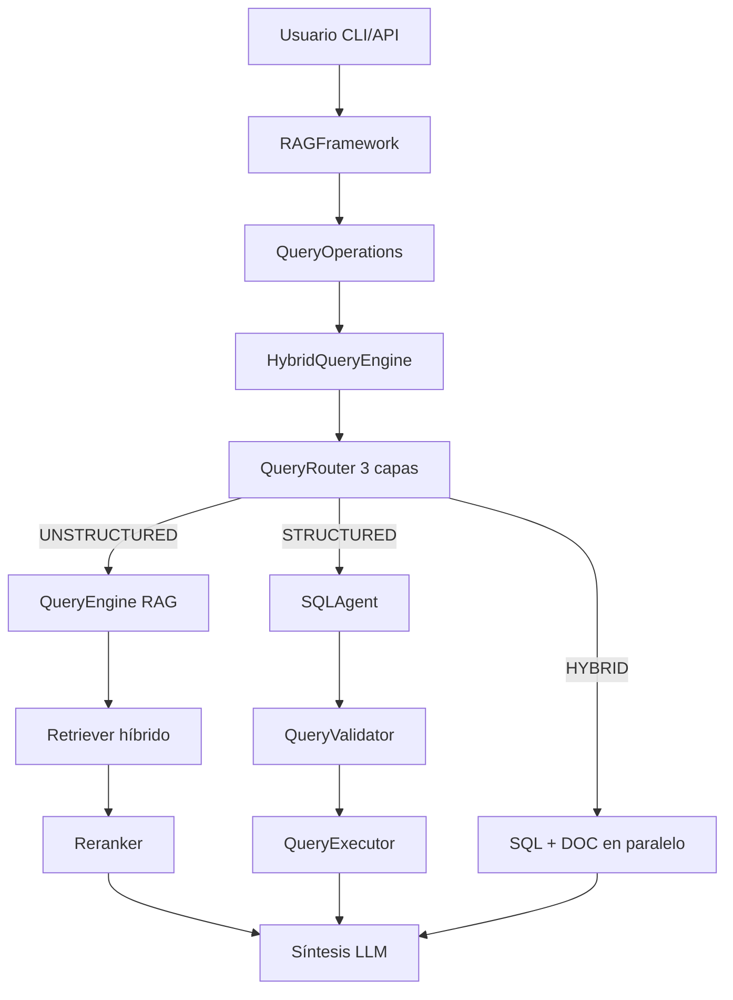

# 📸 Snapshot del Sistema - Sprint 7

## 1. Resumen Ejecutivo del Sprint
El Sprint 7 consolida la arquitectura funcional del sistema RAG híbrido del TFG: una única fachada (`RAGFramework`) que orquesta ingestión documental, recuperación híbrida (vectorial + BM25), reranking, enrutado de consultas en 3 capas (reglas, LLM, fallback) y ejecución SQL segura con síntesis final. El hito técnico es la estabilización de una arquitectura modular por composición (operaciones especializadas) y de una configuración declarativa en YAML suficientemente rica como para gobernar comportamiento, seguridad, routing y metadatos sin modificar código.

## 2. Topología y Arquitectura (Diagramas)
En este sprint la topología de producción queda dividida en dos planos: 
1) plano online de respuesta (router + motor híbrido + SQL/RAG),
2) plano de configuración (YAML) que parametriza decisiones algorítmicas.



## 3. Núcleo Algorítmico y Lógico (Code Chunks)

### 3.1. Fachada de Orquestación por Composición
* **Archivo:** `rag_framework/framework.py`
* **Justificación académica:** Este bloque implementa separación de responsabilidades (SRP) y composición explícita de managers (`Lifecycle`, `Index`, `Query`, `Hybrid`, `Config`). Es relevante para la memoria porque materializa un diseño mantenible y extensible, donde cada subsistema evoluciona sin romper la API pública.
```python
class RAGFramework:
    def __init__(self, config: Optional[RAGConfig] = None) -> None:
        # Initialize lifecycle manager first
        self._lifecycle_mgr = LifecycleManager(self)

        # Initialize and validate configuration
        self.config = self._lifecycle_mgr.initialize_from_config(config)

        # Initialize core component managers
        self._ingestion, self._index_manager, self._query_manager = (
            self._lifecycle_mgr.initialize_managers(self.config)
        )

        # Initialize state variables
        self._index, self._nodes, self._query_engine = self._lifecycle_mgr.reset_state()

        # Initialize hybrid components (lazy-loaded)
        self._hybrid_engine = None
        self._sql_agent = None
        self._router = None

        # Initialize operation managers (use composition pattern)
        self._index_ops = IndexOperations(self)
        self._query_ops = QueryOperations(self)
        self._hybrid_ops = HybridOperations(self)
        self._config_ops = ConfigOperations(self)

        # Display configuration summary
        self._lifecycle_mgr.display_initialization_summary(self.config)
```

### 3.2. Enrutado Jerárquico de Consultas (3 capas)
* **Archivo:** `rag_framework/routing/router.py`
* **Justificación académica:** El diseño en capas minimiza coste esperado: primero reglas deterministas O(1)-like sobre keywords, después clasificación LLM solo en ambigüedad, y por último fallback robusto. Esto reduce latencia media y mejora estabilidad de decisión.
```python
def route(self, query: str) -> RoutingResult:
    """
    Route a query through the 3-layer strategy.

    Layer 1: keyword rules (fast, no LLM).
    Layer 2: LLM classification (if rules inconclusive).
    Fallback: default source (if both layers fail).
    """
    # --- Layer 0: manual override for testing ---
    override = self._check_manual_override(query)
    if override is not None:
        return override

    if not self.router_config.enabled:
        return self._create_default_result(query, "Router disabled")

    if not self.config.sql.enabled:
        return RoutingResult(
            source=SourceTypeEnum.UNSTRUCTURED,
            confidence=1.0,
            method="default",
            reasoning="SQL not enabled, using document retrieval",
        )

    # --- Layer 1: keyword rules ---
    if self.router_config.use_keyword_routing:
        result = self._route_by_rules(query)
        if result is not None:
            return result

    # --- Layer 2: LLM classification ---
    result = self._route_by_llm(query)
    if result is not None:
        return result

    # --- Fallback: default source ---
    logger.warning("All routing layers failed, using default source")
    return self._create_default_result(query, "LLM unavailable, using default")
```

### 3.3. Orquestación Híbrida y Fallback por Resultado Vacío
* **Archivo:** `rag_framework/core/hybrid_engine.py`
* **Justificación académica:** Este bloque refleja robustez operativa: no solo decide fuente, sino que verifica cardinalidad de resultado SQL y reintenta según estrategia configurada. Es un patrón de resiliencia relevante para sistemas en producción.
```python
def _execute_structured_query(
    self,
    question: str,
    routing: RoutingResult,
    start_time: datetime,
) -> HybridQueryResponse:
    """Execute SQL-only query with optional fallback on empty results."""
    source_results = {}

    # Execute SQL query
    sql_result = self._query_sql(question)
    source_results[SourceType.STRUCTURED] = sql_result

    if sql_result.success:
        # Check for 0-row results + fallback configuration
        empty_result = self._is_empty_sql_result(sql_result)
        fallback_cfg = self.config.router

        if empty_result and fallback_cfg.fallback_on_empty:
            logger.info(
                "SQL returned 0 rows — applying fallback strategy: %s",
                fallback_cfg.fallback_strategy,
            )
            return self._apply_fallback(
                question, routing, source_results, start_time
            )
```

### 3.4. Preprocesado de Consulta con Fuzzy Matching y Boost por Metadata
* **Archivo:** `rag_framework/core/query_preprocessor.py`
* **Justificación académica:** Introduce una heurística cuantificable con umbral (`fuzzy_threshold`) y un mecanismo de reponderación (`boost_factor`). Es importante porque conecta NLP ligero (normalización, token overlap, similitud) con mejora de recuperación.
```python
if best_original and best_score >= self.config.fuzzy_threshold:
    # Normalise internal score back to 0-1 for external consumers
    display_score = min(best_score, 1.0)
    result.matched_value = best_original
    result.matched_field = self.config.match_field
    result.similarity = display_score
    result.metadata_filters = MetadataFilters(
        filters=[
            MetadataFilter(
                key=self.config.match_field,
                value=best_original,
                operator=FilterOperator.EQ,
            )
        ]
    )

# 2. Boost field (e.g. document_type based on query keywords)
if self.config.boost_field and self.config.boost_mapping:
    for value, keywords in self.config.boost_mapping.items():
        for kw in keywords:
            if _normalise(kw) in norm_query:
                result.boost_field_value = value
                break
        if result.boost_field_value:
            break
```

### 3.5. Configuración Declarativa del Router y Filtros de Metadata
* **Archivo:** `config/proyectos_docentes.yaml`
* **Justificación académica:** Esta configuración captura conocimiento de dominio en forma de reglas, umbrales y mapeos semánticos. Es esencial para reproducibilidad experimental en la memoria del TFG.
```yaml
router:
  enabled: true
  default_source: unstructured
  use_llm_fallback: true
  confidence_threshold: 0.7
  use_keyword_routing: true
  keyword_confidence_threshold: 0.8
  fallback_on_empty: true
  fallback_strategy: "try_unstructured"

metadata:
  enabled: true
  filtering:
    enabled: true
    match_field: "subject_name"
    fuzzy_threshold: 0.65
    boost_field: "document_type"
    boost_factor: 1.5
```

## 4. Evolución del Modelo de Datos y Configuración
En Sprint 7 el salto clave no es de esquema físico nuevo, sino de modelado semántico y de gobierno de consultas sobre una base SQLite existente:

- En la capa SQL se codifican restricciones de seguridad (solo `SELECT`, límites de filas y tiempo) y ejemplos few-shot para estabilizar generación NL2SQL.
- En recuperación documental, se fijan hiperparámetros de fusión (`alpha=0.6`, `rrf_k=60`, `top_k=25`) y reranking (`top_n=5`) que definen el compromiso precisión-latencia.
- En metadata, se formalizan patrones regex de extracción de `subject_code`, enriquecimiento desde BD (`ASS_CODNUM -> NOMID2`) y filtro difuso con umbral 0.65.

Fragmento representativo:
```yaml
retrieval:
  use_hybrid_search: true
  top_k: 25
  alpha: 0.6
  rrf_k: 60
  reranker:
    enabled: true
    model: BAAI/bge-reranker-v2-m3
    top_n: 5

sql:
  security:
    allow_only_select: true
    max_rows: 100
    max_execution_time: 30.0
  max_retries: 3
```

## 5. Deuda Técnica y Próximos Pasos
La principal deuda identificada al cierre de Sprint 7 es la ausencia de una capa formal de evaluación reproducible integrada en el repositorio principal (métricas IR, precisión del router, robustez SQL, perfil de latencia y cobertura). Esto limita la capacidad de justificar cuantitativamente mejoras iterativas en la memoria académica. También persiste dependencia de umbrales heurísticos fijos (routing y fuzzy matching) sin calibración sistemática sobre conjuntos de validación versionados.