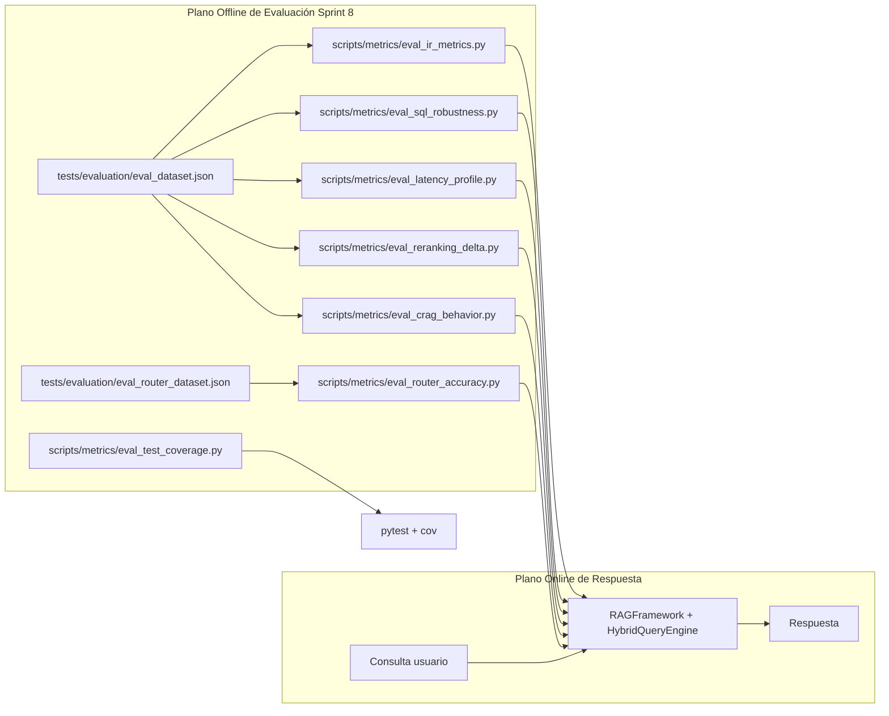

# 📸 Snapshot del Sistema - Sprint 8

## 1. Resumen Ejecutivo del Sprint
El Sprint 8 mantiene intacta la arquitectura funcional del Sprint 7 y añade un subsistema completo de evaluación y métricas en el propio repositorio. El impacto arquitectónico es metodológico: el sistema pasa de estar "solo implementado" a estar "medible y defendible" con scripts reproducibles para calidad de recuperación (HR/MRR/P@k/NDCG), precisión de enrutado, robustez NL2SQL, comportamiento de CRAG, latencia extremo a extremo y cobertura de tests.

## 2. Topología y Arquitectura (Diagramas)
La evolución topológica principal es la incorporación de un plano offline de evaluación conectado al mismo núcleo de ejecución.



## 3. Núcleo Algorítmico y Lógico (Code Chunks)

### 3.1. Harness Base de Evaluación de Recuperación
* **Archivo:** `tests/evaluation/eval_retrieval.py`
* **Justificación académica:** Este bloque define el protocolo experimental base (dataset etiquetado, ejecución sin síntesis LLM, cómputo de métricas IR por consulta) y habilita comparativas controladas entre variantes del pipeline.
```python
def evaluate_retrieval(
    config_path: str,
    dataset_path: str,
    top_k_override: Optional[int] = None,
    full_pipeline: bool = False,
) -> EvalReport:
    """Run retrieval evaluation."""
    # Load dataset
    with open(dataset_path, "r", encoding="utf-8") as f:
        dataset = json.load(f)

    rag_queries = [q for q in dataset if q.get("expected_source_pattern")]

    rag = RAGFramework.from_yaml(config_path)
    rag.load_index()

    rag._query_ops._ensure_query_engine()
    query_engine = rag._query_engine

    retriever = query_engine.retriever
    postprocessors = query_engine.node_postprocessors if full_pipeline else []
    preprocessor = query_engine.query_preprocessor if full_pipeline else None
```

### 3.2. Formalización de NDCG@k
* **Archivo:** `scripts/metrics/eval_ir_metrics.py`
* **Justificación académica:** Introduce una métrica de ranking normalizada (NDCG) que complementa HR y MRR, aportando rigor de Information Retrieval en la memoria del TFG.
```python
def _ndcg_at_k(retrieved_files: List[str], pattern: str, k: int) -> float:
    """Compute NDCG@k with binary relevance (1 if matches pattern, else 0)."""
    regex = re.compile(pattern, re.IGNORECASE)
    subset = retrieved_files[:k]

    # DCG: sum of rel_i / log2(i+1)
    dcg = 0.0
    for i, f in enumerate(subset, start=1):
        rel = 1.0 if regex.search(f) else 0.0
        dcg += rel / math.log2(i + 1)

    if dcg == 0:
        return 0.0

    # IDCG: best possible ordering — all relevant docs first
    n_relevant = sum(1 for f in subset if regex.search(f))
    idcg = sum(1.0 / math.log2(i + 1) for i in range(1, n_relevant + 1))

    return dcg / idcg if idcg > 0 else 0.0
```

### 3.3. Evaluación de Precisión del Router con Matriz de Confusión
* **Archivo:** `scripts/metrics/eval_router_accuracy.py`
* **Justificación académica:** Convierte decisiones de enrutado en un problema de clasificación multiclase evaluable (accuracy, precision, recall, F1), justificando empíricamente la arquitectura de router por capas.
```python
_LABEL_TO_SOURCE = {
    "rag": "unstructured",
    "sql": "structured",
    "hybrid": "hybrid",
    "negative": "unstructured",
}

for label in labels:
    tp = matrix[label][label]
    fp = sum(matrix[other][label] for other in labels if other != label)
    fn = sum(matrix[label][other] for other in labels if other != label)
    support = tp + fn

    precision = tp / (tp + fp) if (tp + fp) > 0 else 0.0
    recall = tp / (tp + fn) if (tp + fn) > 0 else 0.0
    f1 = (
        2 * precision * recall / (precision + recall)
        if (precision + recall) > 0
        else 0.0
    )
```

### 3.4. Perfilado de Latencia por Tipo de Consulta
* **Archivo:** `scripts/metrics/eval_latency_profile.py`
* **Justificación académica:** Añade métricas de rendimiento operacional (p50, p95, media), indispensables para defender viabilidad de despliegue y análisis de cuellos de botella.
```python
def _percentile(data: List[float], pct: float) -> float:
    if not data:
        return 0.0
    sorted_data = sorted(data)
    idx = int(len(sorted_data) * pct / 100)
    idx = min(idx, len(sorted_data) - 1)
    return sorted_data[idx]

for qtype in sorted(by_type.keys()):
    times = by_type[qtype]
    count = len(times)
    p50 = _percentile(times, 50)
    p95 = _percentile(times, 95)
    mean = sum(times) / count
```

### 3.5. Robustez NL2SQL: éxito a primer intento y relajación automática
* **Archivo:** `scripts/metrics/eval_sql_robustness.py`
* **Justificación académica:** Mide confiabilidad de generación SQL en presencia de ambigüedad semántica. Es crítico porque NL2SQL es un subsistema propenso a fallo y esta instrumentación cuantifica resiliencia.
```python
successes = sum(1 for r in results if r["success"])
first_attempt = sum(1 for r in results if r["success"] and r["attempts"] == 1)
relaxed = sum(1 for r in results if r["relaxed"])
failed = n - successes
times = [r["time_ms"] for r in results if r["success"]]

print(f"  Success rate          : {successes}/{n} ({successes/n:.0%})")
print(f"  First-attempt success : {first_attempt}/{n} ({first_attempt/n:.0%})")
print(f"  Required relaxation   : {relaxed}/{n} ({relaxed/n:.0%})")
```

### 3.6. Dataset Etiquetado para Evaluación de Routing
* **Archivo:** `tests/evaluation/eval_router_dataset.json`
* **Justificación académica:** Define el ground truth multiclase necesario para validar el router con metodología supervisada. Sin este dataset no hay inferencia estadística fiable sobre calidad de enrutado.
```json
[
  {"id": "s01", "type": "sql", "query": "¿Cuántas asignaturas hay en el plan de estudios?"},
  {"id": "u01", "type": "rag", "query": "¿Cuál es la metodología de evaluación de Inteligencia Artificial?"},
  {"id": "h01", "type": "hybrid", "query": "¿Cuántos créditos tiene Inteligencia Artificial y qué temas se estudian?"},
  {"id": "n01", "type": "rag", "query": "¿Cuál es el horario de clases de Fundamentos de Programación?"}
]
```

## 4. Evolución del Modelo de Datos y Configuración
En Sprint 8 no se introduce un nuevo esquema transaccional para producción, pero sí un modelo de datos experimental explícito:

- `tests/evaluation/eval_dataset.json`: pares consulta/expectativa (patrones de fuente esperada, keywords esperadas, casos negativos).
- `tests/evaluation/eval_router_dataset.json`: dataset de clasificación para routing (`sql`, `rag`, `hybrid`).
- `scripts/metrics/*.py`: capa de instrumentación reproducible sobre el mismo `RAGFramework`.

La configuración de ejecución sigue gobernada por YAML (`config/proyectos_docentes.yaml`), por lo que el mismo conjunto de hiperparámetros y reglas se evalúa sin desalineación entre entorno de desarrollo y entorno de medición.

## 5. Deuda Técnica y Próximos Pasos
La deuda técnica tras Sprint 8 ya no es la ausencia de métricas, sino su consolidación estadística y trazabilidad longitudinal: 

- Falta versionar resultados históricos (time series) para detectar regresiones entre commits.
- Parte de los scripts incluye modo `--dry-run`; útil para demo, pero debe separarse de resultados oficiales de memoria.
- NDCG usa relevancia binaria por regex sobre nombre de archivo; a futuro conviene relevancia graduada por juicio humano para mayor rigor IR.
- La calibración de umbrales (`confidence_threshold`, `fuzzy_threshold`, `keyword_confidence_threshold`) aún puede optimizarse con búsqueda sistemática (grid/bayes) sobre validación cruzada.

Desde la perspectiva de ingeniería de software, Sprint 8 cierra el ciclo "construir -> medir" y habilita el siguiente ciclo "optimizar -> volver a medir" con base cuantitativa.